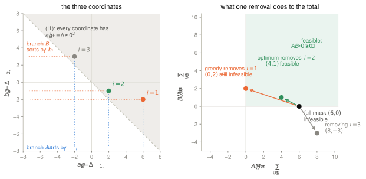
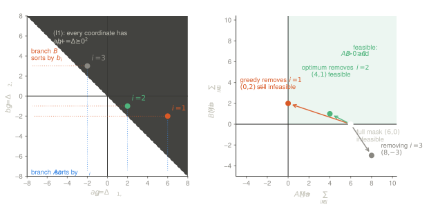

Given task gradients $g_1, g_2 \in \R^d$ and weights $\alpha, \beta > 0$, when
does the weighted step $\Delta = \alpha g_1 + \beta g_2$ fail to make progress on
both tasks at once, and what is the cheapest way to repair it? This note takes
the repair to be a binary mask $m \in \{0,1\}^d$ zeroing as few coordinates as
possible, gives an $\mathcal{O}(d \log d)$ greedy for it, and — this is the part
I got wrong on the first pass — establishes exactly when that greedy is optimal
and exhibits a counterexample showing the condition is necessary.

::: {.callout-note appearance="simple"}
Two later posts pick this up. [Certifying a two-task
step](../2026-08-04-certifying-two-task-steps/) shows the greedy below transports
verbatim to a *continuous* gate — the weight factors straight out of the score of
@eq-score — and settles the practical half of Q1: an $\mathcal{O}(d)$ weak-duality
certificate decides optimality per instance, in exact arithmetic and without
trusting any solver. It also gives a Pareto-layer reduction that shrinks the
candidate set from $d$ to about $\bar K \ln d$. The complexity question of Q1 is
still open.
:::

## Context

Coordinate-wise conflict resolution is a small family. The AND-mask
[@parascandolo2020learning] keeps only coordinates on which every task agrees in
sign, which is far more restrictive than @eq-constraints below: it enforces
agreement per coordinate, whereas we only ask for agreement in aggregate.
GradDrop [@chen2020just] is the nearest neighbour — it also masks coordinate by
coordinate on sign conflict — but it does so stochastically, with a per-coordinate
sampling probability and no global feasibility guarantee; here the constraint is
global and the mask deterministic. PCGrad [@yu2020gradient], CAGrad
[@liu2021conflict], Gradient Vaccine [@wang2021gradient], Nash-MTL
[@navon2022multi] and Aligned-MTL [@senushkin2023independent] all take the other
route, modifying the gradient *values* by projection, rotation or reweighting
rather than zeroing coordinates.

The motivation here is unlearning, where $g_1$ and $g_2$ are the forget and
retain gradients and are conflicting by construction rather than by accident —
a regime the multi-task literature rarely stresses. SalUn [@fan2024salun] already
uses saliency masks over weights for unlearning, but selects them by magnitude
rather than by an alignment constraint.

## Idea

> Gradient conflict between two tasks can be resolved without touching the
> gradients themselves: it is enough to zero coordinates, and sorting them by
> the right score gets you there in one pass.

Why it might be true: the constraint is a pair of linear inequalities in the
mask, and each removed coordinate moves both sides by a known amount, so the
coordinates admit a total order by usefulness. Why it might be false: there are
*two* inequalities, and the order that helps one is mechanically the order that
hurts the other. That tension is the whole subject of
@sec-greedy.

## Formalisation

### Problem

Let $g_1, g_2 \in \R^d$ be task gradients and

$$
\Delta = \alpha g_1 + \beta g_2
$$ {#eq-delta}

their weighted sum. We seek a **binary mask** $m$ under which $\Delta$ still
strictly aligns with both tasks:

$$
\langle m \odot \Delta,\, g_1 \rangle \ >\ 0,
\qquad
\langle m \odot \Delta,\, g_2 \rangle \ >\ 0,
$$ {#eq-constraints}

($\odot$ is the element-wise product) while zeroing as few coordinates as
possible, i.e. minimising $\|\mathbf{1} - m\|_1$. Note this asks for a feasible
mask of **maximum cardinality**, which is strictly stronger than a feasible mask
that is *maximal* for inclusion; the distinction is exactly what
@sec-greedy is about. The inequalities are strict: with $\ge 0$ the null mask is
feasible and the problem degenerates.

### The problem is two linear constraints

Write $M = \operatorname{supp}(m)$ and set

$$
a_i \;=\; \Delta_i\, g_{1,i}, \qquad b_i \;=\; \Delta_i\, g_{2,i},
\qquad
A(M) = \sum_{i \in M} a_i, \quad B(M) = \sum_{i \in M} b_i .
$$ {#eq-ab}

Then @eq-constraints is literally $A(M) > 0$ and $B(M) > 0$, and the problem
reads: *find $M \subseteq [d]$ of maximum cardinality with $A(M) > 0$ and
$B(M) > 0$.* Two identities drive everything that follows.

**(I1) The constraints cannot both fail.** Since $\alpha a_i + \beta b_i =
\Delta_i(\alpha g_{1,i} + \beta g_{2,i}) = \Delta_i^2 \ge 0$, we get $\alpha A(M)
+ \beta B(M) \ge 0$ for every $M$. At most one of the two constraints is violated
at a time — which is what makes a single scalar violation measure meaningful.

**(I2) Non-conflicting coordinates are never worth removing.** Write $s_i =
g_{1,i} g_{2,i}$. If $s_i > 0$ then $g_{1,i}$ and $g_{2,i}$ share a sign, hence
$\Delta_i$ shares it too, hence $a_i > 0$ *and* $b_i > 0$. Removing such an $i$
strictly hurts both constraints, so:

> **Dominance.** Some maximum-cardinality solution removes only coordinates with
> $s_i \le 0$. Equivalently, we may restrict the search to $\{i : s_i \le 0\}$.

Two corollaries. If $s_i > 0$ for even one $i$, the singleton mask $e_i$ is
feasible, so `FAIL` is only ever legitimate when *every* coordinate is in
conflict — a cheap assertion worth putting in the implementation. And the greedy
below must never remove a non-conflicting coordinate, which the original version
of this note got wrong.

### Violation and score

Only $\langle m \odot g_1, g_2 \rangle = \langle g_1, m \odot g_2 \rangle$ can be
negative. Writing $S_{11}(m) = \langle m \odot g_1, g_1\rangle$, $S_{22}(m) =
\langle m \odot g_2, g_2 \rangle$, $S_{12}(m) = \langle m \odot g_1, g_2
\rangle$, @eq-constraints becomes $-S_{12} < \tfrac{\alpha}{\beta} S_{11}$ and
$-S_{12} < \tfrac{\beta}{\alpha} S_{22}$, so the **violation**

$$
V(m) \;=\; -S_{12}(m) \;-\; \min\!\left( \tfrac{\alpha}{\beta} S_{11}(m),\ \tfrac{\beta}{\alpha} S_{22}(m) \right)
\;=\; \max\!\left( \underbrace{-\tfrac{A(m)}{\beta}}_{V_A},\ \underbrace{-\tfrac{B(m)}{\alpha}}_{V_B} \right)
$$ {#eq-violation}

must be brought below zero. **This is a max of two linear functions, not a
scalar budget** — the right-hand identity follows from $-\min(x,y) =
\max(-x,-y)$ and is the fact the original optimality argument overlooked.

Masking out coordinate $i$ lowers $-S_{12}$ by $|s_i|$ but shrinks the
right-hand side too. The net effect on the active branch is

$$
\Delta V \;=\; \tilde{s}_i \;=\;
\begin{cases}
s_i + \frac{\alpha}{\beta} g_{1,i}^2 \;=\; \frac{1}{\beta}\, g_{1,i} \Delta_i \;=\; \frac{a_i}{\beta} & \text{if } \frac{\alpha}{\beta} S_{11} \le \frac{\beta}{\alpha} S_{22},\\[4pt]
s_i + \frac{\beta}{\alpha} g_{2,i}^2 \;=\; \frac{1}{\alpha}\, g_{2,i} \Delta_i \;=\; \frac{b_i}{\alpha} & \text{otherwise,}
\end{cases}
$$ {#eq-score}

so it is $\tilde{s}_i$, not the raw product $s_i$, that ranks candidates: $s_i$
accounts for the drop in $-S_{12}$ while ignoring that the budget shrinks along
with it. In the $(a,b)$ coordinates the scores are just $a_i/\beta$ and
$b_i/\alpha$, and (I1) reads $\tilde s^A_i + \tilde s^B_i = \Delta_i^2/(\alpha\beta)
\ge 0$.

### Algorithm

```text
Greedy masking

Require: g1, g2 ∈ R^d,  α, β > 0,  margin ε > 0

  C    ← { i : g1_i·g2_i ≤ 0 }             # dominance: only conflicting coords
  sA_i ← g1_i·g2_i + (α/β)·g1_i²           # = a_i/β,  S11 branch active
  sB_i ← g1_i·g2_i + (β/α)·g2_i²           # = b_i/α,  S22 branch active
  πA   ← argsort(sA restricted to C);  πB ← argsort(sB restricted to C)
  m    ← 1_d
  S11  ← ⟨g1, g1⟩;  S22 ← ⟨g2, g2⟩;  S12 ← ⟨g1, g2⟩

  while  −S12 ≥ min( (α/β)·S11, (β/α)·S22 ) − ε:
      π ← πA  if  (α/β)·S11 ≤ (β/α)·S22  else  πB
      i ← next index of π with m_i = 1
      if no such i:          return FAIL    # no coordinate left to remove
      if s̃_i ≥ 0:            return FAIL    # every removal now worsens V
      m_i ← 0
      recompute or update:  S11 −= g1_i²,  S22 −= g2_i²,  S12 −= g1_i·g2_i

  if ‖m‖_1 = 0:  return FAIL
  return m
```

Three guards that the first version lacked, and that are not cosmetic. The
restriction to $C$ is (I2). The `s̃_i ≥ 0` exit stops the loop from removing
coordinates that *increase* $V$ — without it the loop keeps stripping the mask
past the point of no return and reports `FAIL` on instances that were only
locally stuck. The $\varepsilon$ margin and the $\|m\|_1 > 0$ check are needed
because the incremental updates to $S_{11}, S_{22}, S_{12}$ drift, and a strict
inequality tested at zero is exactly where drift bites: with all three sums at
$\pm 10^{-18}$, an unguarded loop will happily certify the null mask as feasible.
Recomputing the three sums from $m$ every $k$ iterations is the cheap fix if the
mask is expected to lose many coordinates.

## Optimality: what the greedy does and does not give {#sec-greedy}

A greedy optimality proof needs two lemmas, not one:

- **(L1) locally steepest** — the chosen removal minimises $V$ among all
  available removals;
- **(L2) exchange** — some maximum-cardinality solution contains the first
  coordinate the greedy removes.

The argument I gave originally ("each removal is the steepest one available")
targets (L1) alone, and (L1) without (L2) is local descent, not global
optimality. Worse, (L1) itself is false as stated: $\tilde s_i$ is the slope of
$V_A$ or of $V_B$, not of $V = \max(V_A, V_B)$, and stepping down the active
branch can push it *under* the other one, leaving $V$ unchanged or larger.

### Where the intuition is right: one active constraint

**Proposition.** Let $\emptyset = R_0 \subset R_1 \subset \cdots \subset R_k$ be
the successive removal sets of the greedy. If the same branch is active at every
step $j = 0, \dots, k-1$, then $k$ is optimal.

*Proof.* Say branch $A$ is always active. With no branch switch, $R_j$ is exactly
the set of the $j$ smallest $a_i$, so $A([d] \setminus R_j) = \max_{|R| = j}
A([d] \setminus R)$. For $j < k$ the greedy has not terminated, and branch $A$
active means $V(R_j) = V_A(R_j) = -A/\beta \ge 0$, hence $A([d]\setminus R_j)
\le 0$. By maximality every $R$ with $|R| = j$ gives $A \le 0$ and is infeasible.
So no solution of size $< k$ exists. $\square$ (Symmetric for $B$.)

This is a rearrangement argument, and it works precisely because a single set
simultaneously minimises everything that matters. With one constraint the greedy
is exactly optimal.

### Where it breaks: two constraints

With both constraints live, the set of size $j$ minimising $\sum_R a_i$ and the
one minimising $\sum_R b_i$ are different sets, and rearrangement no longer
applies. The failure is structural, not accidental: by (I1), $a_i < 0$ forces
$b_i \ge -a_i > 0$, so **the steepest coordinate for the active branch is
mechanically among the worst for the other**. An exchange swapping $j \in R^\star$
for the greedy's $i^\star$ does lower $\sum a$, but controls nothing on $\sum b$,
and (I1) guarantees the loss there.

**Counterexample.** $d = 3$, $\alpha = \beta = 1$, $g_1 = (-3,-2,-2)$,
$g_2 = (1,1,3)$. Then $\Delta = (-2,-1,1)$, $a = (6,2,-2)$, $b = (-2,-1,3)$, and
$a_i + b_i = \Delta_i^2 = (4,1,1)$ as (I1) requires. All three $s_i < 0$, so the
dominance rule prunes nothing.

| removed | $A$ | $B$ | $V = \max(-A,-B)$ |
|---|---|---|---|
| $\emptyset$ | $6$ | $0$ | $0$ — infeasible |
| $\{1\}$ ← greedy | $0$ | $2$ | $0$ — no progress |
| $\{2\}$ ← optimum | $4$ | $1$ | $-1$ — feasible |
| $\{3\}$ | $8$ | $-3$ | $3$ |

::: {.light-content}

:::

::: {.dark-content}

:::

*Left: the three coordinates in the $(a,b)$ plane. (I1) confines them to the
half-plane $a + b \ge 0$, which is why $a_1 = +6$ is forced to sit opposite
$b_1 = -2$: the steepest coordinate for one branch is pushed to the wrong side
for the other. Right: the same instance as movements of the total. The greedy
descends $V_B$ as steeply as it can and lands exactly on the boundary $A = 0$;
the optimum takes the coordinate that is steepest for neither.*

Initially branch $B$ is active ($V_B = 0 \ge V_A = -6$), and the greedy takes
$\argmin_i b_i = 1$ since $b_1 = -2 < b_2 = -1$: the steepest step on $V_B$. But
$a_1 = +6$, so $V_A$ climbs back to $0$ and $V$ does not move. Branch $A$ then
becomes active, the greedy removes $3$, and $V$ rises from $0$ to $+1$. It
removes $2$, empties the mask, and returns `FAIL` — while $m = (1,0,1)$ is
feasible with a single removal. The optimum removes coordinate $2$, which is the
steepest for neither branch; it is simply the only one whose gain on $B$ does not
cost too much on $A$. This is (L2) failing: $i^\star = 1$ belongs to no optimal
solution.

Descending the true $V$ instead — removing $\argmin_i \max(V_A + \tilde s^A_i,\,
V_B + \tilde s^B_i)$ — fixes this particular instance in one step, but not the
general case. The suboptimality is a property of the problem, not of the scoring
rule: maximum-cardinality selection under two linear constraints admits no exact
greedy scalarisation.

### How often it matters

Exhaustive search against the pseudo-code above, $d \sim \mathcal{U}[3,14]$,
$\alpha, \beta \sim \mathcal{U}(0.2, 3)$, $g_1$ standard Gaussian and $g_2$
correlated at $\rho$:

| gradient regime | full mask already feasible | greedy suboptimal | of which `FAIL` |
|---|---|---|---|
| $g_1 \perp g_2$ (i.i.d. Gaussian) | $86.7\%$ | $0.005\%$ | — |
| $\rho = -0.6$ | $43.7\%$ | $0.17\%$ | $65\%$ |
| $\rho = -0.9$ | $12.3\%$ | $0.85\%$ | $53\%$ |
| $\rho = -0.99$ | $1.5\%$ | $3.47\%$ | $49\%$ |

The reassuring number in the first row is an artefact of the regime: with
independent gradients the algorithm never runs, because the unmasked step is
already feasible six times in seven. The rate to quote is the one in the conflict
regime the method exists for, and there about half of the suboptimal cases are
outright `FAIL`s on instances that admit a feasible mask. Nor does it wash out
with dimension — at $\rho = -0.95$ the rate is $0.60, 1.88, 2.56, 1.80,
0.92\,\%$ for $d = 3, 5, 8, 11, 13$: it peaks in the middle of the range brute
force can reach, and whatever happens past $d = 14$ is extrapolation.

The Proposition is what separates the two regimes. Splitting the same runs by
whether the active branch ever switched: **$0$ suboptimal out of $13{,}504$**
runs without a switch, against $379$ out of $5{,}155$ ($7.4\%$) with one. Branch
alternation is the entire failure mode, and it is observable at runtime — so the
algorithm can certify its own optimality for free, by reporting whether it
switched.

### Complexity

Dominated by the two `argsort` calls ($\mathcal{O}(d \log d)$) with
$\mathcal{O}(d)$ updates; each order is scanned by a monotone pointer that only
ever skips already-removed indices, so switching branches costs nothing
asymptotically.

## Two objections to the formulation itself

These bite harder than the optimality gap, and I do not have answers to either.

**Sparsity is not the quantity of interest.** A mask with $\langle m \odot
\Delta, g_2 \rangle = 10^{-9}$ satisfies @eq-constraints and is useless — task 2
does not move. Because we minimise the number of removals, the optimum is always
pinned to the feasibility boundary: *by construction the returned solution is the
one with the least possible alignment.* A margin constraint $\langle m \odot
\Delta, g_k \rangle \ge \varepsilon \|m \odot \Delta\| \|g_k\|$ (angular
alignment), or a normalised objective $\max_m \min(\hat a(m), \hat b(m))$, would
be far more defensible. The $\varepsilon$ in the pseudo-code is a numerical guard,
not a substitute for this.

**If $\alpha, \beta$ are free, masking may be unnecessary.** The unmasked step is
feasible iff $\alpha S_{11} + \beta S_{12} > 0$ and $\alpha S_{12} + \beta S_{22}
> 0$. For $r = \alpha/\beta$ and $S_{12} < 0$ this is an interval,

$$
r \;\in\; \left( \frac{|S_{12}|}{S_{11}},\ \frac{S_{22}}{|S_{12}|} \right),
$$ {#eq-ratio}

non-empty iff $S_{12}^2 < S_{11} S_{22}$ — Cauchy–Schwarz, strict unless $g_1
\parallel g_2$. So **for any non-collinear pair there is always an open set of
weight ratios under which the full mask is feasible, available in closed form.**
On the counterexample above the admissible interval is $(0.647, 1.000)$ and
$\alpha = \beta = 1$ sits exactly on its boundary; at $r = 0.8$ no masking is
needed at all. This does not sink the method — the weights are often fixed by the
problem, and moving them trades away the loss balance one actually wants — but it
means masking has to be justified *against* reweighting, and @eq-ratio is the
baseline to beat.

## Open questions

- **Q1. Exact algorithm.** Maximum-cardinality selection under two linear
  constraints is a bicriteria knapsack. Is the two-constraint case with the
  structure $\alpha a_i + \beta b_i = \Delta_i^2 \ge 0$ polynomial, or is the
  greedy plus its certificate the practical ceiling?
- **Q2. A sharper sufficient condition.** The Proposition assumes no branch
  switch at all. A single switch is presumably still safe under some condition on
  the crossing; the empirical $7.4\%$ says most alternating runs are fine anyway.
- **Q3. Margin formulation.** Does the angular-margin version keep the
  sort-and-scan structure, or does normalisation by $\|m \odot \Delta\|$ destroy
  the total order that makes @eq-score work?
- **Q4. More than two tasks.** With $n > 2$ the violation is a max of $n$ linear
  functions and (I1) becomes $\sum_k \alpha_k \langle m\odot\Delta, g_k\rangle =
  \|m \odot \Delta\|^2 \ge 0$ — still one constraint violable at a time only in
  the pairwise sense. The stopping condition needs non-trivial modification.

## Reproducing

In this post's directory, `verify.py` regenerates every number in this note: the
counterexample, the regime table, the dimension scaling and the branch-switch
split. It brute-forces all $2^d$ masks, so it is limited to $d \le 14$; it runs
on CPU in a few minutes. `make_figures.py` draws the figure above, recomputing
$(a_i, b_i)$ from $g_1, g_2$ and asserting agreement with the table rather than
hard-coding it.

## References

::: {#refs}
:::
