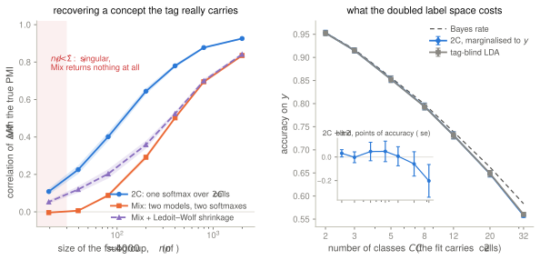
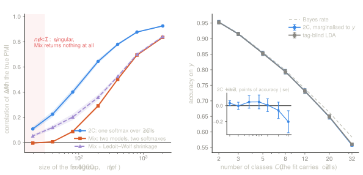
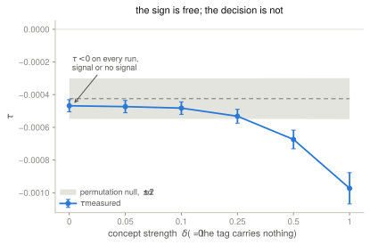
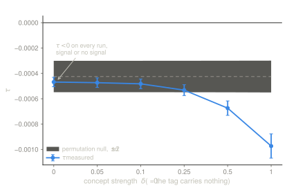

Suppose the training data carries a primary label $y \in \{1,\dots,C\}$ **and** a
binary tag $s \in \{\mathsf{r}, \mathsf{f}\}$ that is known while fitting but
irrelevant at inference: retain/forget, clean/noisy, real/synthetic,
source/target, poisoned/benign. The usual reflex is to fit one model per value of
$s$ and combine them afterwards. This note argues for the other order, and calls
the result the **2C construction**.

> Fit a single model on the product space $(y, s)$ rather than mixing separate
> models, because joint normalisation turns the attribute into an exploitable
> direction in logit space.

2C was introduced for machine unlearning [@dine2026exact], but nothing in it is
about forgetting. What follows is the general version: a way of extracting a
concept that you already know how to label.

## Where the normalisation happens

Everything downstream follows from one choice, so it is worth stating carefully.
Any model that predicts $y$ ends in a normalisation — scores over candidate
labels, exponentiated and divided by their sum. The only question is what that
sum runs over.

**Leave $s$ out of it.** The sum runs over the $C$ labels. The tag is then at best
a latent split inside each label, invisible to the normaliser, and anything it
carries has to be recovered after the fact — in practice by fitting a second
model and differencing the two in logit space. Two models, two normalisations.

**Put $s$ in it.** Promote $(y,s)$ to a label in its own right, so the sum runs
over $C \times 2$ cells:

$$
P(y, s \mid x) \;=\;
\frac{\exp g_{y,s}(x)}
     {\sum_{y'=1}^{C} \sum_{s' \in \{\mathsf r, \mathsf f\}} \exp g_{y',s'}(x)}.
$$ {#eq-2c}

Here $g$ is whatever scores the cells: the rows of a network's output layer, the
discriminants of a fitted density model, anything. (For a generative proxy,
$g_{y,s}(x) = \log \pi(y,s) + \log P(x \mid y,s)$ and @eq-2c is Bayes on the
product space — but nothing below depends on reading it that way.)

In words: one normalisation over $2C$ cells, so the $\mathsf r$ and $\mathsf f$ cells
of *every* class compete with each other directly, not just within their own
class. Class posteriors come back by marginalising, $P(y \mid x) = \sum_s P(y,s
\mid x)$, so the original task survives — but not for free: the same capacity now
has to cover $2C$ cells instead of $C$. Whether that costs accuracy on $y$ is an
empirical question, settled by a curve of accuracy against $C$ rather than by
argument — [measured below](#what-the-extra-cells-cost): nothing detectable up to
$64$ cells at $n = 4000$, and $0.20 \pm 0.14$ points at $C = 32$.

Both routes describe the same data. They do not produce the same object:

> The question is not how to combine the two models. It is whether there are two.

Scores normalised separately live on unrelated scales, and a difference taken
across them means something only once someone picks a coefficient. Two columns of
a single normalisation are already commensurable, and their difference is a
quantity rather than a direction times a guess.

```{=html}
<figure style="margin:2rem 0;">
<svg viewBox="0 0 720 250" role="img" aria-label="C cells with an internal mixture versus 2C cells in direct competition"
     style="width:100%;height:auto;color:inherit;">
  <g stroke="currentColor" fill="none" stroke-width="1.6">
    <!-- left panel: C cells, mixture inside -->
    <rect x="20" y="60" width="300" height="120"/>
    <line x1="120" y1="60" x2="120" y2="180"/>
    <line x1="220" y1="60" x2="220" y2="180"/>
    <g stroke-dasharray="4 4" opacity="0.45">
      <line x1="70"  y1="60" x2="70"  y2="180"/>
      <line x1="170" y1="60" x2="170" y2="180"/>
      <line x1="270" y1="60" x2="270" y2="180"/>
    </g>
    <!-- right panel: 2C cells, all frontiers real -->
    <rect x="400" y="60" width="300" height="120"/>
    <line x1="500" y1="60"  x2="500" y2="180"/>
    <line x1="600" y1="60"  x2="600" y2="180"/>
    <line x1="400" y1="120" x2="700" y2="120"/>
  </g>
  <g fill="currentColor">
    <circle cx="45"  cy="120" r="4"/><circle cx="145" cy="120" r="4"/><circle cx="245" cy="120" r="4"/>
    <circle cx="450" cy="90"  r="4"/><circle cx="550" cy="90"  r="4"/><circle cx="650" cy="90"  r="4"/>
  </g>
  <g fill="none" stroke="currentColor" stroke-width="1.6">
    <circle cx="95"  cy="120" r="4"/><circle cx="195" cy="120" r="4"/><circle cx="295" cy="120" r="4"/>
    <circle cx="450" cy="150" r="4"/><circle cx="550" cy="150" r="4"/><circle cx="650" cy="150" r="4"/>
  </g>
  <g fill="currentColor" font-size="13" font-family="system-ui, sans-serif" text-anchor="middle">
    <text x="170" y="40">C cells, mixture inside</text>
    <text x="550" y="40">2C cells, direct competition</text>
    <text x="70"  y="205">y=1</text><text x="170" y="205">y=2</text><text x="270" y="205">y=3</text>
    <text x="450" y="205">y=1</text><text x="550" y="205">y=2</text><text x="650" y="205">y=3</text>
    <text x="370" y="95"  text-anchor="end" opacity="0.7">r</text>
    <text x="370" y="155" text-anchor="end" opacity="0.7">f</text>
  </g>
</svg>
<figcaption style="font-size:0.9em;opacity:0.75;margin-top:0.5rem;">
Solid lines are softmax frontiers; dashed lines are internal to a cell and
invisible to the normaliser. Filled dot = <em>r</em>, open dot = <em>f</em>.
On the left the tag is a latent split inside each class; on the right it is a
coordinate of the label.
</figcaption>
</figure>
```

Two consequences follow, and the second is the surprising one.

**$P(s \mid x)$ comes out for free, coupled to the class structure.** No separate
attribute classifier is needed: marginalising the other way, $P(s \mid x) =
\sum_y P(y,s \mid x)$, reads off the same softmax, and it is estimated jointly
with the class geometry rather than beside it.

**The minority subgroup can be implicitly stabilised.** This one depends on how
the cells are scored, so take the Gaussian instantiation as an illustration.
LDA-2C has $2C$ mean vectors but a **single** pooled covariance
matrix. The explicit mixture, LDA-Mix, needs two — one of which is estimated on
the $\mathsf f$ subset alone, which is usually the small one. The richer
parametrisation is therefore also the cheaper and the better-conditioned; the
extra means cost $O(Cd)$ parameters while the avoided covariance would have cost
$O(d^2)$ estimated on few points. That trade is favourable while $C \lesssim d$;
at language-model vocabulary sizes it runs the other way, and the argument for 2C
there rests on the shared normalisation rather than on parameter count.

This is the one claim here that is cheap to check, so it is checked
[below](#does-any-of-it-happen) — including in the regime where it fails, which
is when the tag reshapes the cells rather than moving them.

## The signal, and why it is reusable

The fit itself says whether there is anything to read, and the check is one
scalar. Write $f(x)$ for the logits of the model being corrected and take

$$
\tau \;=\; \E\bigl[\, \mathrm{softmax}(f(x))^{\top} \Delta M(x) \,\bigr],
$$ {#eq-tau}

the average of the offered correction under the model's own predictive
distribution. It is one pass over the available sample: no gradients, and — so
this note claimed before it was measured — no threshold to choose, because the
decision is the sign. $\tau < 0$ says there is a direction worth applying;
$\tau \ge 0$ says leave the release alone. The sign looks like the right
criterion rather than an arbitrary one because $\tau$ is the derivative at
$\eta = 0$ of the average log-normaliser under the correction — it measures which
way the correction moves the model at the moment it starts being applied.

::: {.callout-warning appearance="simple"}
That last step does not survive being checked. The sign of $\tau$ is not a
decision rule: [measured below](#is-the-sign-test-a-test), it comes out negative
on every single run *including when the tag carries nothing at all*, and there is
an identity saying it had to. What the derivative reading gives is a magnitude
worth comparing against a null, not a sign worth reading.
:::

So @eq-tau answers, for the price of one sum — or of a handful of them, once the
null below is taken seriously — the question one would otherwise settle by
training something and looking at the result: *is $s$ visible at all to whatever
computes the scores $g$?* An answer indistinguishable from the null is
information rather than a failure: the two readings coincide, so there is no
direction to extract, and the response is to do nothing, or to score the cells
some other way — not to push harder. The honest diagnosis is "there is nothing to
extract here", not "the method missed it".

When the answer is positive, marginalise twice — over both tags, and within the
$\mathsf r$ block only — and take the log-difference:

$$
\Delta M(x) \;=\; \log P_{\mathsf r}(\cdot \mid x) \;-\; \log P(\cdot \mid x)
\;\in\; \R^{C}.
$$ {#eq-signal}

In words: for each class, how much more (or less) probable that class becomes
when the $\mathsf f$ cells are dropped from the competition.

The signal has an exact information-theoretic reading. Since
$P_{\mathsf r}(y \mid x) = P(y, \mathsf r \mid x) / P(\mathsf r \mid x)$,

$$
\Delta M_y(x) \;=\; \log \frac{P(y, \mathsf r \mid x)}{P(y \mid x)\, P(\mathsf r \mid x)}
\;=\; \mathrm{PMI}\bigl(y ; \mathsf r \mid x\bigr),
$$ {#eq-pmi}

the pointwise mutual information between the class and the tag at $x$. So
$\Delta M$ vanishes identically exactly when $y$ and $s$ are conditionally
independent given $x$ under the fitted model: the signal measures a dependence
rather than approximating one.

It is also a vector in logit space, and can be used in two ways:

- **as a logit processor** — add $\eta \cdot \Delta M(x)$ to the output of an
  existing model: no weights and no gradients, though $\Delta M$ still has to be
  computed from whatever representation the scores $g$ read, so this is black-box
  only relative to that;
- **by distillation** — fold the correction back into the parameters when the
  network is available.

The structural point is that the concept is extracted **once**, and only then
applied, at whatever strength $\eta$ one wants. That is not what fine-tuning
does: there, extraction and application are the same optimisation trajectory, and
there is no object left over that can be turned up, turned down, or merely
measured.

## Why one softmax and not two

$\Delta M$ is not new as an object. Logit-difference unlearning already computes
something of that shape: ULD [@ji2024reversing] reads it off an assistant model
trained beside the original, UCD [@suriyakumar2025ucd] off two proxy models
differenced against each other — the same shape as contrastive decoding
[@li2023contrastive]. What is new is where it comes from. In all these cases the
correction is *assembled* rather than derived, and assembling costs something
specific:

> Separate models mean separate softmaxes, hence independent normalisations. The
> columns being differenced do not live in a common scale, and the mixing
> coefficient is the free parameter that glues them back together.

This is the argument classifier-free guidance [@ho2022classifier] already made
against classifier guidance: one conditional model with a null token instead of
two differenced networks, and the guidance direction read as a difference between
two readings of that single distribution. 2C is that move with a secondary
attribute in place of the conditioning.

In 2C the $\mathsf r$, $\mathsf f$ and marginal columns all fall out of one
normalisation. $\Delta M$ is then a difference between two readings of a single
distribution rather than between two models: there is no scale to reconcile, and
nothing to glue. And because the columns come from one fit rather than from a
second training run, the check of @eq-tau applies *before* anything is applied at
all — including to a correction assembled the other way.

## What else the tag can be

Worth saying plainly rather than leaving implicit: on generic unlearning, the
test of @eq-tau will usually return *do nothing*. When $\Df$ is an arbitrary
subset of the same distribution — a random 5% of the training set, some
particular user's rows — there is no attribute to encode. $P(s \mid x)$ is not
learnable, $\Delta M$ is zero up to estimation noise, and leaving the release
untouched is the correct answer. That is not a failure mode. It is the
construction reporting, for one sum and before any optimisation, that the request
it was handed has no geometric content — which is more than the methods that
would have spent a fine-tuning run discovering the same thing.

The flip side is that it tells you where the construction *does* have content:
wherever $s$ is a genuine property of $x$ rather than a bookkeeping label. Those
cases are not the one it came from.

| $s$ encodes | What $\Delta M$ gives |
|---|---|
| A spurious attribute (background, texture, watermark) | A shortcut-bias correction direction |
| Clean vs. noisy label | Correction for the contribution of mislabelled examples |
| Real vs. synthetic | A measure of the model's reliance on generated data |
| Source vs. target domain | A domain-adaptation signal without retraining |
| Poisoned vs. benign | Backdoor neutralisation |
| Demographic subgroup | Audit: $\lVert \Delta M \rVert$ quantifies how much the decision depends on $s$ |

These are directions, not validated results. The last row deserves its own
sentence, though, because it uses the machinery differently: one does not apply
the correction at all, only measure its magnitude — which, by @eq-pmi, is a
conditional-dependence measure rather than a heuristic score. 2C becomes an
instrument rather than an intervention.

## Does any of it happen?

Everything above is an argument about where a normalisation sits, and an
argument of that shape is exactly the kind that survives on plausibility until
someone measures it. So: a synthetic setting where the truth is known in closed
form, which is the only way to score an estimate of $\Delta M$ against the thing
it is estimating rather than against another estimate.

Draw $y$ uniform over $C$ classes and $s = \mathsf f$ with probability
$\epsilon$, and let

$$
x \mid (y,s) \;\sim\; \mathcal{N}\!\bigl(\mu_y + \delta\,\mathbb{1}[s = \mathsf f]\,v_y,\ \Sigma_s\bigr),
$$ {#eq-synth}

with $C = 5$, $d = 30$, $n = 4000$, and class separation set so the Bayes rate
sits near $0.86$ — an easy problem measures nothing. The concept directions $v_y$
are **per class**, and that is not decoration: a tag that moves every class the
same way leaves $y$ and $s$ all but conditionally independent given $x$, so by
@eq-pmi the true PMI is near zero and there is genuinely nothing for any
estimator to find. The first version of this experiment used a single shared $v$
and spent a while measuring the resulting nothing.

Two estimators, both plain LDA, differing only in where the normalisation is:
**2C** fits $2C$ means and *one* pooled covariance over all $n$ points; **Mix**
fits one LDA per tag, so its $\mathsf f$ covariance is estimated on the
$\mathsf f$ subset alone. Ledoit–Wolf shrinkage on Mix is included as the
steelman of the baseline.

### Recovering a concept the tag really carries

::: {.light-content}

:::

::: {.dark-content}

:::

*Left: correlation between the estimated $\Delta M$ and the true PMI, over $20$
seeds, as the $\mathsf f$ subgroup shrinks. Right: accuracy on the original task
as $C$ grows, with the paired difference inset — the two curves are on top of
each other, and the inset is the only honest way to show it.*

Since the true PMI shrinks with $\epsilon$ — a rare tag means $P_{\mathsf r}$ is
close to $P$ — an absolute error rewards an estimator that gives up and returns
zero. The table therefore reports the RMSE **relative** to the RMS of the true
PMI, so that $1.00$ is exactly the score of returning zero, alongside the
correlation, which giving up cannot fake:

| $\epsilon$ | $n_f$ | RMS of true PMI | 2C | Mix | Mix + LW | $\kappa(\hat\Sigma_{\mathsf f})$ |
|---:|---:|---:|---|---|---|---:|
| $0.5$ | $1998$ | $0.69$ | $\mathbf{0.39}$ / $\mathbf{0.93}$ | $0.65$ / $0.84$ | $0.61$ / $0.84$ | $9$ |
| $0.2$ | $799$ | $0.31$ | $\mathbf{0.55}$ / $\mathbf{0.88}$ | $0.98$ / $0.70$ | $1.03$ / $0.70$ | $10$ |
| $0.1$ | $401$ | $0.17$ | $\mathbf{0.78}$ / $\mathbf{0.78}$ | $1.41$ / $0.50$ | $1.66$ / $0.52$ | $12$ |
| $0.05$ | $200$ | $0.10$ | $1.24$ / $\mathbf{0.64}$ | $2.15$ / $0.29$ | $3.08$ / $0.36$ | $16$ |
| $0.02$ | $81$ | $0.04$ | $2.27$ / $\mathbf{0.40}$ | $3.10$ / $0.09$ | $6.36$ / $0.20$ | $39$ |
| $0.01$ | $39$ | $0.02$ | $3.76$ / $\mathbf{0.23}$ | $2.19$ / $0.01$ | $7.69$ / $0.12$ | $1.8{\times}10^{6}$ |
| $0.005$ | $20$ | $0.01$ | $7.35$ / $\mathbf{0.11}$ | $1.00$ / $-0.00$ | $7.55$ / $0.05$ | $9.7{\times}10^{6}$ |

: normalised RMSE / correlation with the true PMI, $20$ seeds {tbl-colwidths="[8,8,14,24,20,20,14]"}

Three things, of which only the first is the one I expected.

**The single normalisation wins throughout, and by more as the subgroup
shrinks.** At $\epsilon = 0.5$ the two are within a factor of $1.7$ on error; by
$\epsilon = 0.05$ 2C's correlation is $0.64$ against Mix's $0.29$. Shrinkage
recovers part of the *shape* Mix loses ($0.20$ against $0.09$ at $n_f = 81$)
while making the magnitude worse, which is what shrinkage is: variance traded for
bias. It never reaches 2C.

**Below $n_f \approx d$ the baseline does not degrade, it collapses.**
$\hat\Sigma_{\mathsf f}$ becomes singular, the $\mathsf f$ cells get no posterior
mass, and $\Delta M$ comes out *identically zero* — correlation $-0.00$ and a
relative RMSE of exactly $1.00$, which is the score of returning nothing. Note
how that looks on an absolute error: at $\epsilon = 0.005$, Mix's raw RMSE is the
best in the table. It is the best because the truth is nearly zero there too.
This is the reason the table is normalised, and it is a good argument for never
reporting an absolute error against a quantity whose scale is a free parameter of
the experiment.

**Past $\epsilon \approx 0.05$ nobody recovers the magnitude.** Relative RMSE
above $1$ means the estimate is worse than zero in squared error, for 2C as much
as for Mix. The *shape* survives a good deal further — 2C still correlates at
$0.40$ with $81$ tagged points — so the audit reading of @eq-pmi outlasts the
correction reading. Which sets a scope this note did not have before: the
construction extracts a usable direction while the tagged subgroup is a few
percent of the data, and degrades to a dependence *detector* below that.

### The assumption that carries the win

2C's advantage is not free-standing. It comes from spending its extra
parameters on means and sharing one covariance, so it is a bet that the tag
moves the cells rather than reshaping them. Rerun the same experiment with a tag
that changes the covariance instead — $\Sigma_{\mathsf f} \ne
\Sigma_{\mathsf r}$ — and the ordering does not narrow, it inverts:

| $\epsilon$ | $n_f$ | 2C | Mix | Mix + LW |
|---:|---:|---|---|---|
| $0.2$ | $799$ | $1.00$ / $0.07$ | $\mathbf{0.24}$ / $\mathbf{0.97}$ | $0.24$ / $0.97$ |
| $0.05$ | $200$ | $1.01$ / $0.05$ | $\mathbf{0.52}$ / $\mathbf{0.86}$ | $0.47$ / $0.90$ |
| $0.02$ | $81$ | $1.03$ / $0.08$ | $1.02$ / $0.48$ | $\mathbf{0.68}$ / $\mathbf{0.80}$ |

: same measure, when the tag is a covariance shift {tbl-colwidths="[10,10,27,27,26]"}

2C returns $1.00$ — nothing — because a single pooled covariance has nowhere to
put a covariance-borne concept. The claim to keep is therefore narrower than
"one softmax beats two": *the shared normalisation wins when the attribute lives
in the means, which is also when the shared covariance is a real modelling
assumption rather than a convenience.* When it does not, the mixture is right
and 2C is structurally blind, and @eq-tau will say so — this is exactly the
"score the cells some other way" branch, arrived at from data.

### What the extra cells cost

The note said above that whether $2C$ cells cost accuracy on $y$ "is an
empirical question, settled by a curve of accuracy against $C$", and that I did
not have the curve. Here it is: the right panel of the figure, at fixed
$n = 4000$, comparing 2C marginalised to $y$ against a tag-blind LDA. Paired over
seeds, in points of accuracy:

| $C$ | 2 | 5 | 12 | 20 | 32 |
|---|---:|---:|---:|---:|---:|
| 2C $-$ tag-blind | $+0.03$ | $+0.05$ | $+0.01$ | $-0.06$ | $-0.20$ |
| $\pm 2$ se | $0.03$ | $0.08$ | $0.08$ | $0.10$ | $0.14$ |
| gap to Bayes | $0.03$ | $0.32$ | $0.76$ | $1.43$ | $2.52$ |

At $C = 32$ the fit carries $64$ cells and loses $0.20 \pm 0.14$ points — the
first entry that clears its own error bar, and an order of magnitude smaller
than the $2.5$ points both models are already giving away to the Bayes rate.
The doubling is not what limits this model; estimating $C$ classes from $4000$
points is. That is a *cheap* regime statement, not a general one: it holds while
the extra means are affordable, and the note's own caveat about vocabulary-sized
$C$ stands untouched.

### Is the sign test a test? {#is-the-sign-test-a-test}

No. This is the part where the measurement contradicts the note.

::: {.light-content}

:::

::: {.dark-content}

:::

*$\tau$ against the concept strength $\delta$, with the band obtained by
shuffling the tag and refitting — $12$ permutations, $12$ seeds. At $\delta = 0$
the tag is pure noise and $\tau$ is still negative every time.*

$\tau < 0$ on $100\%$ of runs at every $\delta$ tested, **including
$\delta = 0$**, where the tag is independent of everything. The reason is not
subtle once looked at. For any two distributions,

$$
\sum_y P(y \mid x)\,\bigl[\log P_{\mathsf r}(y \mid x) - \log P(y \mid x)\bigr]
\;=\; -\,\mathrm{KL}\bigl(P(\cdot \mid x)\,\|\,P_{\mathsf r}(\cdot \mid x)\bigr)
\;\le\; 0 ,
$$ {#eq-kl}

so whenever the model being corrected is close to the proxy's own marginal —
which is the default situation, and exactly the situation in which one reaches
for this — $\tau$ is a negative KL divergence up to that discrepancy. It is
negative because $\Delta M$ is not identically zero, and $\Delta M$ is not
identically zero because it was estimated from a finite sample. The sign carries
no information about whether $s$ is real.

The magnitude does, once it has something to be compared against. Shuffling the
tag and refitting gives the noise floor directly:

| $\delta$ | $0$ | $0.05$ | $0.1$ | $0.25$ | $0.5$ | $1.0$ |
|---|---:|---:|---:|---:|---:|---:|
| $z$ against the permutation null | $-0.65$ | $-0.72$ | $-0.86$ | $-1.65$ | $-3.94$ | $-8.78$ |
| below all $12$ permutations | $17\%$ | $17\%$ | $25\%$ | $50\%$ | $83\%$ | $100\%$ |
| $\tau < 0$ | $100\%$ | $100\%$ | $100\%$ | $100\%$ | $100\%$ | $100\%$ |

The last row is the claim this note made; the first two are what it should have
made. The corrected version of the test is: compute $\tau$, permute the tag,
recompute, and read the position of $\tau$ in that null. The price is $K$ refits
of a model that was cheap by construction, which is a modest thing to pay for a
decision that was otherwise being read off a coin. And the diagnostic reading
survives intact — it just needs a null, like every other statistic that decides
whether an effect exists.

## Open questions

- **Q1. Where does the mean/covariance dichotomy actually bind?** The reversal
  above is stated for LDA, where "the concept is in the means" is a literal
  parameter split. For a network the analogue is unclear: the $2C$ output rows
  are means in logit space, but what plays the role of the shared covariance is
  whatever the trunk has learned. Is there a diagnostic, before fitting, for
  which side of the dichotomy a given tag falls on?
- **Q2. The $C$ curve at realistic $C$.** The measured cost is negligible up to
  $64$ cells at $n = 4000$. The regime that matters for the language-model case
  is $C$ in the tens of thousands with a shared trunk, where the argument for 2C
  rests on the shared normalisation rather than on parameter count. Nothing here
  speaks to it.
- **Q3. A calibrated null without $K$ refits.** The permutation null costs $K$
  fits. For the Gaussian case $\tau$'s null distribution ought to be available in
  closed form, or at least to first order in $1/n$, which would put the test back
  at the price of one sum.
- **Q4. What does $\eta$ do?** Everything measured here is about *extracting*
  $\Delta M$. The note claims the extracted direction can then be applied at
  whatever strength one wants, and that claim has not been tested at all: no
  curve of anything against $\eta$ appears above.

## Reproducing

In this post's directory, `experiment.py` regenerates every number above — the
recovery tables, the capacity curve, the permutation null — and
`check_tau_identity` in it asserts @eq-kl numerically. `make_figures.py` draws
the two figures from the saved results. A few minutes on CPU.

## References

::: {#refs}
:::
