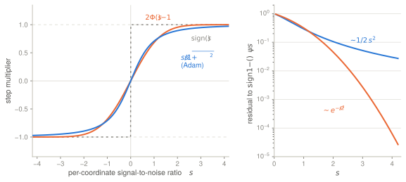
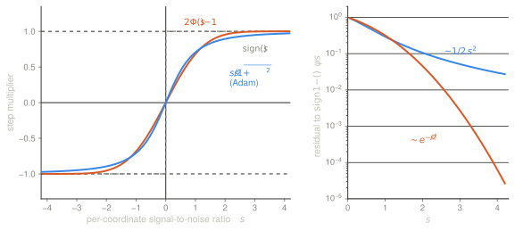
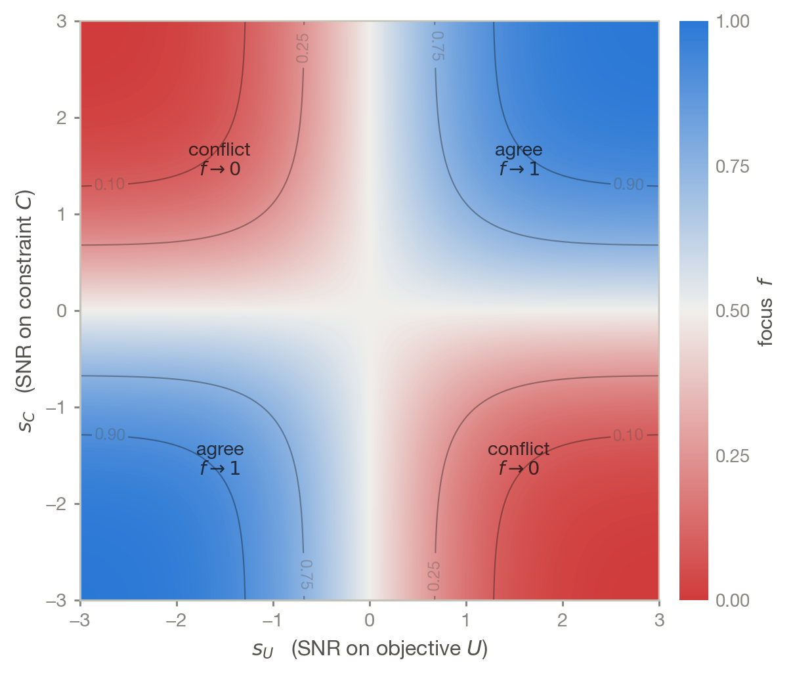
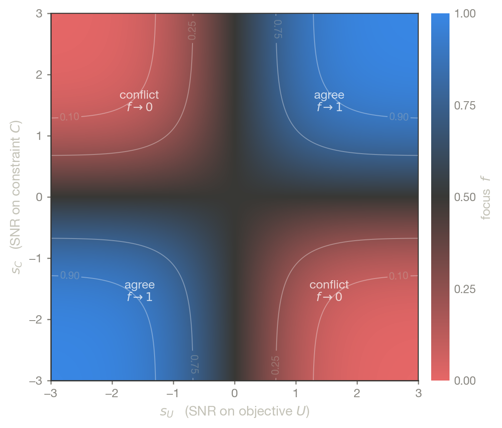

Training against two objectives at once is the normal case: fit the new data and
don't regress on the old, follow preferences and stay capable, adapt to the
target domain and keep the source. Two separate questions come up, and they are
worth keeping apart:

1. **How should the two gradients be combined?** This is what PCGrad
   [@yu2020gradient], CAGrad [@liu2021conflict] and their relatives answer, by
   computing a combination rather than fixing one.
2. **Which coordinates deserve to be trusted at all,** given that both gradients
   are noisy estimates measured on finite batches?

This post is about the second question only. The answer turns out to be a
per-coordinate gate that composes with any answer to the first, and it comes
from re-reading Adam [@kingma2015adam] as an implicit — and, it turns out,
miscalibrated — probability statement. It is also close to free: the gate
consumes only quantities a two-task step has already computed, so it adds no
gradient evaluation at all.

> Adam's per-coordinate step is an unstated answer to *given what I measured,
> what is the probability that my true gradient agrees with me?* Stating the
> question puts the modelling assumptions where they can be checked and fixed —
> and asking it about two tasks gives a gate on their agreement.

::: {.callout-note appearance="simple"}
This post assumes the two tasks' measurement noises are independent, which holds
when their batches are drawn separately and fails when they share one. The
correlated case — the ordinary one — is treated in [Two losses, one
batch](../2026-08-05-correlated-batch-noise/), which also measures how large the
correlation actually gets.
:::

The construction comes from [@dine2025improving], where it was derived for one
particular pair of tasks. Nothing in it depends on that choice, so what follows
states it for two arbitrary tasks. Three things here are not in the paper: a
correction to the prior
(§[Calibration](#calibration-is-where-the-prior-shows-up)), a strictly weaker
hypothesis for the descent guarantee (§[The guarantee](#the-guarantee)), and a
small ablation (§[Does it help?](#does-it-help)).

## What Adam actually computes

Write Adam per coordinate, dropping the bias correction:

$$
\theta_{t+1} = \theta_t - \eta\,\frac{\hat m_t}{\sqrt{\hat v_t} + \epsilon},
\qquad
\hat m_t = \mathrm{EMA}(\hat g_t), \quad \hat v_t = \mathrm{EMA}(\hat g_t^2).
$$ {#eq-adam}

Model the successive gradients of coordinate $i$ as $\hat g_t \sim
\mathcal{N}(\mu, \sigma^2)$, i.i.d. — $\mu$ the true gradient, $\sigma$ the
measurement noise. Then $\E[\hat m_t] = \mu$, $\E[\hat v_t] = \mu^2 + \sigma^2$,
and the multiplier in @eq-adam concentrates on

$$
\frac{\mu}{\sqrt{\mu^2 + \sigma^2}} \;=\; \frac{s}{\sqrt{1+s^2}}
\;=:\; \psi_{\mathrm{Adam}}(s),
\qquad s \doteq \frac{\mu}{\sigma}.
$$ {#eq-psi-adam}

Adam's step on a coordinate is a function of that coordinate's signal-to-noise
ratio and nothing else — the variance-adaptation reading of
[@balles2018dissecting]. $\psi_{\mathrm{Adam}}$ is odd, maps $\R \to (-1,1)$, is
linear near the origin and tends to $\pm 1$, so Adam interpolates between plain
SGD at low SNR and signSGD [@bernstein2018signsgd] at high SNR. The $\epsilon$
only keeps the ratio finite.

Simulating @eq-adam with $\beta_1 = 0.9$, $\beta_2 = 0.999$ confirms
@eq-psi-adam is not an artefact of the approximation:

| true SNR $s$ | 0.1 | 0.5 | 1.0 | 2.0 | 5.0 |
|---|---|---|---|---|---|
| $\E[\hat m/\sqrt{\hat v}]$ simulated | 0.102 | 0.456 | 0.704 | 0.894 | 0.980 |
| $s/\sqrt{1+s^2}$ | 0.100 | 0.447 | 0.707 | 0.894 | 0.981 |

## The question Adam answers without saying so

Since $\psi_{\mathrm{Adam}} \in (-1,1)$, the step multiplier can be read as
$\hat p_{\mathrm{Adam}} \doteq \tfrac{1}{2}(1 + \psi_{\mathrm{Adam}}(|s|))$ — a
claimed confidence that the step direction is the right one. Adam is therefore
already answering a probabilistic question, without naming it:

> I measured $\hat g_i$ on this batch. What is the probability that the true
> gradient $\mu_i$ points the same way?

With a prior on $\mu_i$ this has an exact answer. Take the prior flat: the
posterior is $\mu_i \mid \hat g_i \sim \mathcal{N}(\hat g_i, \sigma_i^2)$ and

$$
p_i \;\doteq\; \mathbb{P}\!\left[\mu_i \hat g_i > 0 \,\middle|\, \hat g_i\right]
\;=\; \Phi\big(|s_i|\big),
\qquad s_i \doteq \frac{\hat g_i}{\sigma_i},
$$ {#eq-p1d}

with $\Phi$ the standard Gaussian CDF. Note the argument: $s_i$ here is the
*measured* SNR $\hat g_i/\sigma_i$, whereas the $s$ of @eq-psi-adam is the *true*
SNR $\mu/\sigma$. They are not the same variable, and comparing the two rules
requires putting them on one axis. The signed form of @eq-p1d,

$$
\psi(s) \;\doteq\; 2\Phi(s) - 1
\;=\; \operatorname{sign}(\hat g)\,\big(2p - 1\big)
\;=\; \E\!\left[\operatorname{sign}(\mu) \mid \hat g\right],
$$ {#eq-psi}

is the quantity a step should be proportional to: $2p-1$ is the net evidence for
the direction about to be taken.

::: {.light-content}

:::

::: {.dark-content}

:::

*Left: the two squashings. Right: how fast each commits to the sign. Adam's
residual doubt decays polynomially, $1 - \psi_{\mathrm{Adam}}(s) \sim 1/2s^2$;
$\Phi$'s decays like $e^{-s^2/2}$. Both are plotted against their own argument —
see the next section for why that matters.*

## Calibration is where the prior shows up

It is tempting to stop here and say the posterior is calibrated and Adam is not.
That claim does not survive being checked, and the reason is instructive.

Fix a true SNR $s$ and average over the measurement noise. The frequency with
which $\operatorname{sign}(\hat g) = \operatorname{sign}(\mu)$ is $\Phi(s)$. What
does each rule *claim*? Adam claims $\hat p_{\mathrm{Adam}}(s)$. The flat-prior
rule claims $\E[\Phi(|\hat g|/\sigma)]$, which is not $\Phi(s)$: since $\hat
g/\sigma \sim \mathcal{N}(s, 1)$, the averaging costs a factor $\sqrt{2}$ in the
argument. Measured over $4{\times}10^5$ draws per row:

| true SNR $s$ | actual $\Phi(s)$ | Adam claims | flat-prior rule claims |
|---:|---:|---:|---:|
| 0.25 | 0.599 | 0.621 ( $+0.023$ ) | 0.755 ( $+0.156$ ) |
| 0.50 | 0.691 | 0.724 ( $+0.032$ ) | 0.769 ( $+0.078$ ) |
| 1.00 | 0.841 | 0.854 ( $+0.012$ ) | 0.817 ( $-0.024$ ) |
| 2.00 | 0.977 | 0.947 ( $-0.030$ ) | 0.928 ( $-0.050$ ) |
| 4.00 | 1.000 | 0.985 ( $-0.015$ ) | 0.998 ( $-0.002$ ) |

In the low-SNR region — which is most coordinates — the flat-prior rule is
*more* overconfident than Adam, by a wide margin. The cause is the prior: flat
says a coordinate is as likely to have an enormous true gradient as a tiny one,
whereas the empirical distribution over coordinates is concentrated near zero.
When the signal is weak, large $|\hat g|$ is mostly noise, and a flat prior takes
it at face value.

The fix is standard and cheap. Put a scale on the prior, $\mu \sim
\mathcal{N}(0, \tau^2)$; the posterior probability becomes

$$
p_i = \Phi\!\left(c\,\frac{|\hat g_i|}{\sigma_i}\right),
\qquad
c = \frac{\tau}{\sqrt{\tau^2+\sigma^2}} = \sqrt{1 - \frac{\sigma^2}{\E[\hat g^2]}} ,
$$ {#eq-shrink}

a shrinkage of the SNR. And $c$ is estimable rather than tuned: $\E[\hat g^2]$ is
what Adam's second moment already tracks, and $\sigma^2$ is the noise estimate we
need anyway, so $\tau^2 = \E[\hat g^2] - \sigma^2$ is available by pooling over
coordinates. Expected calibration error over deciles, $8{\times}10^5$ draws:

| prior scale | flat prior | shrunk, $c$ estimated | Adam implicit |
|---|---:|---:|---:|
| $\tau = 0.5$ | 0.120 | **0.003** | 0.130 |
| $\tau = 1.0$ | 0.053 | **0.002** | 0.058 |
| $\tau = 2.0$ | 0.014 | **0.002** | 0.025 |

So the honest version of the headline is narrower than "Adam is miscalibrated
and $\Phi$ fixes it". Adam's multiplier and the flat-prior posterior are both
badly calibrated, in different ways. What the probabilistic reading buys is that
the miscalibration is *nameable and correctable*: it lives in one place, the
prior, and one estimated scalar removes it. That is a real advantage over a
square root chosen for algebraic convenience, but it is an advantage about
diagnosability, not about being right by default.

## Two tasks

Let $L_1$ and $L_2$ be two losses to decrease simultaneously, each measured on
its own batch:

$$
\hat g_1 = g_1 + N_1, \quad N_1 \sim \mathcal{N}(0; \Sigma_1),
\qquad
\hat g_2 = g_2 + N_2, \quad N_2 \sim \mathcal{N}(0; \Sigma_2),
$$ {#eq-model}

with $N_1 \perp N_2$, $g_k \doteq \nabla L_k$, and $\sigma_{k,i}^2 \doteq
\Sigma_{k,(i,i)}$. What we want from an update:

::: {#def-aligned name="alignment with both tasks"}

&nbsp;

An update direction $\Delta$ is **aligned** with $L_1$ and $L_2$ at $\theta$ if
$\langle \Delta, g_1(\theta)\rangle \le 0$ and $\langle \Delta,
g_2(\theta)\rangle \le 0$: a descent direction for both, to first order.

:::

::: {#prp-focus name="the focus vector"}

&nbsp;

Write $\varphi_k \doteq \Phi(c_k \hat g_k / \sigma_k)$ component-wise. The
probability that the two *true* gradients agree in sign on coordinate $i$ is

$$
f_i \;\doteq\; \mathbb{P}\!\left[g_{1,i}\,g_{2,i} > 0 \,\middle|\, \hat g_1, \hat g_2\right]
\;=\; \varphi_{1,i}\varphi_{2,i} + (1-\varphi_{1,i})(1-\varphi_{2,i})
\;=\; \tfrac{1}{2}\Big(1 + \psi_{1,i}\,\psi_{2,i}\Big),
$$ {#eq-focus}

where $\psi_{k,i} = 2\varphi_{k,i} - 1$ is the calibrated soft sign of @eq-psi.

:::

The second equality is one line: substitute $\varphi = (1+\psi)/2$ and the linear
terms cancel. The gate is the product of two soft signs, rescaled from $[-1,1]$
to $[0,1]$; equivalently $2f-1 =
\E[\operatorname{sign}(g_1)\operatorname{sign}(g_2) \mid \hat g_1, \hat g_2]$ is
a per-coordinate sign correlation between the tasks.

::: {.light-content}

:::

::: {.dark-content}

:::

*The gate $f$ over the two SNRs. Along either axis one task carries no signal and
$f = \tfrac{1}{2}$: the coordinate is neither trusted nor blocked, just
half-stepped.*

Setting the second argument to the measurement itself — $\hat g_2 \doteq \hat
g_1$ taken as a noiseless direction, $\sigma_2 \to 0$, so $\varphi_2 =
\mathbb{1}[\hat g_1 > 0]$ — makes both branches of @eq-focus
collapse to $\Phi(|s_1|)$, exactly @eq-p1d. This is a statement about the
*formula*, not an instance of the model: taking the measurement as a second task
breaks the assumption that $g_2$ is fixed given $\theta$. The one-dimensional
rule is the same algebra at a degenerate argument, which is worth knowing, but it
is not a limit inside the family.

## What the gate is not

The gate says nothing about how much each task should count. That is
$(\alpha,\beta)$, and $f \ge 0$ means the gate can only attenuate a coordinate,
never flip it — so it cannot fix a badly chosen weighting, and it cannot rotate
the update into a direction the aggregation did not propose. Methods that
*compute* the combination — PCGrad's projection [@yu2020gradient], CAGrad
[@liu2021conflict] — solve a different problem, and solve it in a way the gate
cannot.

The two compose. Write any aggregation $\mathrm{Agg}(\hat g_1, \hat g_2)$ and
gate it:

$$
\Delta \;\doteq\; -\,f \odot \mathrm{Agg}(\hat g_1, \hat g_2),
\qquad
\mathrm{Agg}(x,y) = \alpha x + \beta y \;\text{ or PCGrad, CAGrad, etc.}
$$ {#eq-update}

```text
Adam2D — one step

Require: batch gradients  ĝ1, ĝ2 ∈ R^d ;  noise scales σ1, σ2 ∈ R^d₊
         aggregation Agg ; learning rate η ; stability ε

  c1, c2 ← shrinkage factors, Eq. (5)      # pooled over coordinates
  ψ1 ← 2Φ(c1·ĝ1 / (σ1+ε)) − 1              # calibrated soft sign, task 1
  ψ2 ← 2Φ(c2·ĝ2 / (σ2+ε)) − 1
  f  ← (1 + ψ1 ⊙ ψ2) / 2                   # P[the two tasks agree]
  Δ  ← − f ⊙ Agg(ĝ1, ĝ2)
  θ  ← Optimize(θ, Δ, η)                   # outer optimiser: Adam, SGD, …
```

Note the last line: the gated direction is handed to an outer optimiser rather
than applied raw. This matters more than it looks, because $f$ attenuates the
step by $\mathrm{mean}(f) \approx 0.4$ in practice; applied as a raw SGD step,
that attenuation reads as a learning-rate cut and can dominate everything else
in a comparison.

### The add-on costs no extra gradients

The structural point in favour of this construction is that it is pure
recycling: **it needs no gradient that a two-task method has not already
computed.** Everything it consumes — $\hat g_1$, $\hat g_2$, and a second moment
the optimiser is already tracking — is on hand, and the arithmetic on top is
$\mathcal{O}(d)$ elementwise. Saliency masking [@fan2024salun], by contrast,
requires a third backward pass to build its mask.

"No extra gradients" is not the same as "free", so here is the measured bill.
A 1.7M-parameter MLP, batch 512, 4 CPU threads, everything as a multiple of one
full gradient evaluation:

| item | cost |
|---|---:|
| the two task gradients | $2\times$ — you were paying this anyway |
| gate arithmetic ($2 \times$ `erf`, in-place, $\mathcal{O}(d)$) | $0.43\times$ |
| noise scale, reusing the optimiser's second moment | $0\times$ (biased — see below) |
| noise scale, two half-batch gradients per task | $+0.32\times$ per task |
| *for reference*: PCGrad's projections | $0.25\times$ |

So the cheap-and-biased configuration adds about a fifth of a gradient
evaluation, and the statistically correct one about half — the same order as the
aggregation rules it sits on top of, and well under the cost of a third backward
pass. Micro-batching splits a batch you were going to process anyway, so its
FLOPs are unchanged in principle; the overhead measured above is memory traffic
from accumulating $d$-sized buffers, which is why it is worth accumulating the
mean and sum of squares online — two buffers, independent of $k$ — rather than
stacking $k$ gradients.

### What the gate does at the corners

| regime | $f$ | behaviour |
|---|---|---|
| both variances $\to 0$ | $\{0,1\}$ | the hard AND-mask [@parascandolo2020learning] on the measured gradients |
| both variances $\to \infty$ | $1/2$ | halve the learning rate, change nothing else |
| one task uninformative | $1/2$ | abstain, half-step |
| $L_2 = L_1$ on a second batch | $\tfrac{1}{2}(1+\psi(s^{(1)})\,\psi(s^{(2)}))$ | one task, gated by whether two batches agree |

## The guarantee

The guarantee in [@dine2025improving] assumes the measured gradients are
scalarly independent in expectation, $\E[\langle \hat g_1, \hat g_2\rangle] = 0$.
That hypothesis is stronger than the proof needs, and stronger than one would
want: since the noises are independent and centred, $\E[\langle \hat g_1, \hat
g_2\rangle] = \langle g_1, g_2\rangle$, so it says the true gradients are
*orthogonal* — ruling out aggregate conflict, $\langle g_1, g_2\rangle < 0$,
which is the case PCGrad and CAGrad exist for. The gate would be guaranteed
exactly where it is least needed.

It can be replaced by something weaker and more natural. Write the
**focus-weighted** second moments

$$
\tilde S_{12} \doteq \sum_i f_i\, \hat g_{1,i}\hat g_{2,i},
\qquad
\tilde S_{11} \doteq \sum_i f_i\, \hat g_{1,i}^2 \ge 0,
\qquad
\tilde S_{22} \doteq \sum_i f_i\, \hat g_{2,i}^2 \ge 0 ,
$$ {#eq-stilde}

noting that $\tilde S_{12} = \langle f \odot \hat g_1, \hat g_2\rangle = \langle
\hat g_1, f \odot \hat g_2\rangle$ is symmetric — the gate can sit on either
side. Expanding $\Delta$ against the *measured* gradients is pure algebra,

$$
\langle \Delta, \hat g_1\rangle = -\alpha \tilde S_{11} - \beta \tilde S_{12},
\qquad
\langle \Delta, \hat g_2\rangle = -\alpha \tilde S_{12} - \beta \tilde S_{22},
$$ {#eq-cond}

so both inner products are non-positive if and only if a single scalar
inequality holds:

$$
V(f) \doteq -\tilde S_{12} - \min\!\Big(\tfrac{\alpha}{\beta}\tilde S_{11},\ \tfrac{\beta}{\alpha}\tilde S_{22}\Big) \;\le\; 0 .
$$ {#eq-viol}

Checked against the two conditions on $5000$ random draws, the equivalence is
exact — $0$ disagreements. Readers of the [$\ell_1$ masking
post](../2026-07-23-l1-gradient-masking/) will recognise @eq-viol: it is the same
violation functional, with the binary mask $m$ replaced by the continuous gate
$f$. The two constructions meet here, which is not a coincidence — the quadratic
structure is identical and only the weight differs.

### Three levels of guarantee

It is worth separating what @eq-viol buys at three different strengths, because
only one of the three depends on a prior.

::: {.callout-note appearance="simple"}
The three levels are stated more carefully — and the hybrid sketched at the end
of this section is measured — in [Certifying a two-task
step](../2026-08-04-certifying-two-task-steps/). One correction belongs here
rather than there: this post presents the batch certificate as though it
inherited the prior's calibration problems, and it does not. Only level (ii)
touches the prior at all.
:::

**(i) Empirical, deterministic, free.** @eq-cond involves no probability at all:
$V(f) \le 0$ *is* the statement that $\Delta$ is a feasible direction for the
batch gradients $\hat g_1, \hat g_2$. Every term is computed by Algorithm 1
already, so this level is observable batch by batch and holds with the same
epistemic status as the deterministic result of the $\ell_1$ post applied to
empirical gradients. No assumption whatsoever.

**(ii) In expectation, conditional on a prior.** Lifting the statement from
$\hat g$ to the true $g$ is where the modelling enters, via $\E[g \mid \hat g] =
\hat g$ — the flat-prior posterior mean, not a frequentist identity; with $g$
deterministic it is false. This is the level the proposition below states, and
the level at which the [calibration
section](#calibration-is-where-the-prior-shows-up) bites.

**(iii) PAC, with a margin.** Certifying at $V(f) \le -\tau$ rather than $V(f)
\le 0$, with $\tau$ on the scale of the noise, buys feasibility on the true
gradients with high probability under a sub-Gaussian noise model. This level is
the interesting one precisely because it absorbs miscalibration: a doubtful
prior is paid for with a larger margin rather than with a broken guarantee.

::: {#prp-guarantee name="alignment in expectation"}

&nbsp;

Let $\mathrm{Agg}$ be $\alpha x + \beta y$ with $\alpha, \beta > 0$. If
$\E[\tilde S_{12}] \ge 0$, then $\Delta$ of @eq-update is aligned with both
tasks in expectation, and for small enough $\eta > 0$, $\E[L_k(\theta + \eta
\Delta)] \le L_k(\theta)$ for $k = 1, 2$.

:::

This is strictly weaker than the original hypothesis. Because $f_i \ge
\tfrac{1}{2}$ exactly when $\hat g_{1,i}\hat g_{2,i} > 0$, the gate up-weights
agreeing coordinates and down-weights conflicting ones, giving the *pathwise*
bound

$$
\tilde S_{12} \;\ge\; \tfrac{1}{2}\,\langle \hat g_1, \hat g_2\rangle
$$ {#eq-pathwise}

— verified over $2000$ draws, minimum slack $+4 \times 10^{2}$ — so
$\E[\langle \hat g_1, \hat g_2\rangle] \ge 0$ implies $\E[\tilde S_{12}] \ge 0$
and not conversely. The gap is the whole point: $\E[\tilde S_{12}]$ stays
positive well into genuine conflict, because $f$ suppresses precisely the
coordinates that make the plain inner product negative. With $g_2$ drawn at
correlation $\rho_{\mathrm{task}}$ to $g_1$ — the correlation of the **true
gradients**, i.e. the degree of conflict, not to be confused with the
measurement-noise correlation $\rho_i$ of Q1 below — $d = 3000$, 300 draws per
row:

| $\rho_{\mathrm{task}}$ | $\langle g_1, g_2\rangle$ | $\E[\tilde S_{12}]$ | fraction $> 0$ |
|---:|---:|---:|---:|
| $-0.3$ | $-900$ | $+1154$ | 1.00 |
| $-0.6$ | $-1800$ | $+769$ | 1.00 |
| $-0.9$ | $-2700$ | $+424$ | 1.00 |

So the new hypothesis covers the conflict regime that the old one excluded,
which is the regime the gate was built for.

**Better still, it need not be assumed.** @eq-viol is *observable*: $\tilde
S_{11}$, $\tilde S_{22}$, $\tilde S_{12}$ are three inner products over
quantities Algorithm 1 already computes. A step can therefore be certified
batch by batch rather than assumed in expectation — and when the test fails, the
greedy $\ell_1$-minimal masking of the [earlier
post](../2026-07-23-l1-gradient-masking/) applies unchanged on top of the gate,
since removing coordinate $i$ changes $V$ by exactly

$$
\tilde s_i = f_i\Big(\hat g_{1,i}\hat g_{2,i} + \tfrac{\alpha}{\beta}\hat g_{1,i}^2\Big)
$$ {#eq-greedy}

on the branch where $\tfrac{\alpha}{\beta}\tilde S_{11}$ is active, and
symmetrically on the other — the focus weight factors straight out (checked
numerically to $8\times10^{-14}$). Sorting by $\tilde s_i$ and masking until $V
\le 0$ gives a hybrid "focus + $\ell_1$-minimal mask" whose feasibility holds by
construction on every batch.

**Where a proper prior splits the test.** Under $g_i \sim \mathcal{N}(0,
\tau_i^2)$ the lift uses $\E[g_i \mid \hat g_i] = \lambda_i \hat g_i$ with
$\lambda_i = \tau_i^2/(\tau_i^2+\sigma_i^2)$, and $\hat\tau_i^2 =
(\widehat{\mathrm{Var}}(\hat g_i) - \hat\sigma_i^2)_+$ is estimable by pooling
over a layer, so this is a fix rather than an obstacle. Each $\tilde S$ picks up
a $\lambda_i$ factor and the equivalence with descent survives ($0$
disagreements over $3000$ draws) — but the two inequalities then carry
*different* cross terms, $\sum_i f_i \lambda_{1,i} \hat g_{1,i}\hat g_{2,i}$
against $\sum_i f_i \lambda_{2,i} \hat g_{1,i}\hat g_{2,i}$, so the single
scalar $V$ of @eq-viol no longer exists. Note where the split happens: only at
level (ii). Level (i) never sees $\lambda$, so the batch certificate stays
single and symmetric. Everything collapses back to @eq-viol as soon as
$\lambda_1 \propto \lambda_2$ coordinate-wise — equal prior-to-noise ratios
across tasks — which is exact to $2\times10^{-15}$ numerically.

**The trust region needs restating.** The bound in [@dine2025improving] is
written with $\|m\|_0$ for a *binary* mask, where the count of selected
coordinates is meaningful and shrinks during training. For the continuous gate
that bound is vacuous: $\Phi > 0$ strictly, so $f_i > 0$ almost surely and
$\|f\|_0 = d$ at every step. The right statement uses the same norm on both
sides,

$$
\|\theta' - \theta\|_q \;\le\; \eta\,\|f\|_q\,\|\mathrm{Agg}\|_\infty ,
$$ {#eq-vicinity}

which is informative because $\|f\|_q$ genuinely measures how much the gate
closes — empirically $\|f\|_1 / d \approx 0.50$ and $\|f\|_2 / \sqrt{d} \approx
0.56$ on random inputs.

## Does it help? {#does-it-help}

A gate whose effect is claimed and never measured is not worth much, so: a small
two-task adaptation problem. An MLP is pretrained on classes 0–4 of `digits`,
then adapted to classes 5–9 with a retention loss on the old classes available
as the second task. Noise scales come from micro-batching — the standard error
of the batch mean — not from an EMA along the trajectory, which would mix
sampling noise with the drift of $\theta$. Since aggregation and gating are
separate questions, the design is a $2 \times 2$: each cell tuned over its own
$(\eta, \alpha)$ grid, 12 seeds, gated direction fed to an outer Adam.

| aggregation | gate | new-class acc | old-class acc | mean |
|---|---|---:|---:|---:|
| sum | off | $0.9647 \pm 0.0025$ | $0.9815 \pm 0.0016$ | $0.9731 \pm 0.0015$ |
| sum | **on** | $0.9681 \pm 0.0020$ | $0.9828 \pm 0.0018$ | $\mathbf{0.9754 \pm 0.0013}$ |
| PCGrad | off | $0.9669 \pm 0.0018$ | $0.9812 \pm 0.0015$ | $0.9740 \pm 0.0012$ |
| PCGrad | **on** | $0.9603 \pm 0.0023$ | $\mathbf{0.9892 \pm 0.0013}$ | $0.9748 \pm 0.0015$ |

Paired over seeds, switching the gate on changes the mean accuracy by $+0.0023
\pm 0.0008$ over a plain sum (9 wins out of 12) and by $+0.0007 \pm 0.0015$ over
PCGrad (7 out of 12). Read plainly: the gate buys a small but consistent
improvement when the aggregation does nothing about conflict, and nothing
measurable once PCGrad has already removed the conflicting component. It does
visibly shift the operating point toward retention — the best old-class accuracy
in the table is PCGrad plus gate, by a clear margin.

This is one small dataset, one architecture, one pair of tasks, and effect sizes
of a fifth of a point. It is enough to show the gate is not free of effect and
not a disaster; it is not enough to claim it helps in general, and the
composition result suggests the honest expectation is "helps where nothing else
handles conflict". The experiment that would settle it is a real multi-task
benchmark against a tuned CAGrad, which I have not run.

## Estimating $\sigma$

Everything rests on the per-coordinate noise scale, and the convenient shortcut
is a trap. Reading Adam's second moment $\hat v$ gives $\mu^2 + \sigma^2$, not
$\sigma^2$; and an EMA taken along the trajectory mixes sampling noise with the
drift and curvature encountered as $\theta$ moves, so it does not estimate the
noise at a fixed $\theta$ at all. The pair $\hat v - \hat m^2$
[@zhuang2020adabelief] fixes the first problem and not the second.

The estimator that matches @eq-model is the standard error of the batch mean:
split the batch into $k$ micro-batches, take $\hat g$ as their mean and
$\mathrm{std}/\sqrt{k}$ as $\sigma$. It processes the same samples as one full
gradient — $k$ backward passes on sub-batches instead of one on the whole batch —
so it buys the noise estimate without a single extra pass over data, at the
measured overhead in the cost table above. This is what the experiment uses.
Per-sample gradient norms give the same thing more precisely at higher cost.

Note also that $\sigma$ for a batch mean scales as $1/\sqrt{B}$, so the gate
should sharpen with batch size. Any estimator that ignores $B$ leaves that on the
table.

## Open questions

- **Q1. Correlated measurement noise.** @eq-model assumes $N_1 \perp N_2$, which
  fails whenever the two losses see the same samples: a shared fraction $\kappa$
  of a batch induces $\mathrm{Cov}(N_1, N_2) \approx \tfrac{\kappa}{B}
  \mathrm{Cov}_{\text{per-sample}}$. The gate generalises exactly — the agreement
  probability becomes a bivariate orthant probability,
  $$f_i^{\rho} = \Phi_2(a_i, b_i; \rho_i) + \Phi_2(-a_i, -b_i; \rho_i),
  \qquad a_i = \hat g_{1,i}/\sigma_{1,i},\ b_i = \hat g_{2,i}/\sigma_{2,i},$$
  cheap to evaluate via Owen's T, reducing to @eq-focus at $\rho = 0$ and to
  Sheppard's $\tfrac{1}{2} + \tfrac{\arcsin \rho}{\pi}$ at $a = b = 0$ (both
  checked). What does *not* survive is the pivot $f_i \ge \tfrac{1}{2}
  \Leftrightarrow \hat g_{1,i}\hat g_{2,i} > 0$: the neutral level moves to
  $\tfrac{1}{2} + \tfrac{\arcsin\rho_i}{\pi}$, so @eq-pathwise breaks and with it
  the original proof — while the @eq-viol route, which needs only $f \ge 0$ and
  measurability, goes through verbatim. Estimating $\rho_i$ needs the cross
  covariance, which the optimiser's moments do not carry — but *aligned*
  micro-batches do, for nothing. Taken up in full in [Two losses, one
  batch](../2026-08-05-correlated-batch-noise/), where the correlation is
  measured rather than assumed away: $\overline{|\rho|} = 0.75$ on a
  shared-batch retention pair, against $0.055$ when the batches are disjoint.
- **Q2. More than two tasks.** $\mathbb{P}[\text{all } n \text{ agree}] = \prod_k
  \varphi_k + \prod_k (1 - \varphi_k)$ decays to $2^{1-n}$ and gates everything
  shut for moderate $n$. Pairwise gates are the obvious repair.
- **Q3. A per-coordinate prior.** @eq-shrink pools $\tau$ over all coordinates,
  which is crude — the scale of the true gradient plainly differs by layer. A
  per-layer or hierarchical $\tau$ is cheap and might matter more than anything
  else here.
- **Q4. Beyond Gaussian.** @eq-model is the one modelling choice in the whole
  construction, and gradient noise is heavier-tailed than Gaussian. Swapping
  $\Phi$ for a Student-$t$ CDF changes nothing structurally — @eq-focus survives
  any symmetric noise family — but it changes the tail.

## Reproducing

In this post's directory: `make_figures.py` regenerates the figures,
`experiment_ablation.py` the $2\times2$ table, and `experiment_frontier.py` the
per-method tuning frontier it was derived from. `experiment.py` holds the shared
model, data and update rules. Everything runs on CPU in a few minutes.

## References

::: {#refs}
:::
