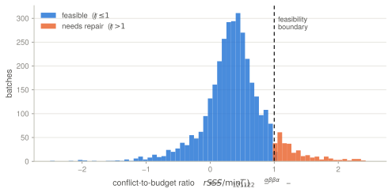
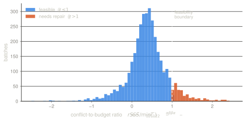

Two earlier posts turn out to be the same construction seen from two sides. The
[$\ell_1$ masking post](../2026-07-23-l1-gradient-masking/) builds the
sparsest binary mask making an update align with two task gradients, and gets a
deterministic guarantee. The [Adam2D post](../2026-08-03-two-dimensional-adam/)
builds a continuous gate $f$ from the probability that the two true gradients
agree in sign, and gets a guarantee in expectation. This post joins them.

> The feasibility of a gated step is an *observable, deterministic* property of
> the batch — no prior, no expectation. When it holds, the gate is certified for
> free; when it fails, the $\ell_1$-minimal mask repairs it by removing about
> $0.3\%$ of coordinates. What the measurements then show is that genuine
> conflict is the exception: most failures are a task sitting at its own optimum
> with nothing left to certify. The certificate earns its keep as an instrument
> for telling those apart, and only secondarily as a safety net.

Notation follows the Adam2D post: two losses $L_1, L_2$, batch gradients $\hat
g_1, \hat g_2$, per-coordinate noise scales $\sigma_k$, gate $f_i = \tfrac12(1 +
\psi(s_{1,i})\psi(s_{2,i}))$ with $\psi = 2\Phi(\cdot) - 1$, and the update
$\Delta = -f \odot (\alpha \hat g_1 + \beta \hat g_2)$.

## Three levels of guarantee

Write the focus-weighted second moments

$$
\tilde S_{12} \doteq \sum_i f_i \hat g_{1,i}\hat g_{2,i},
\quad
\tilde S_{11} \doteq \sum_i f_i \hat g_{1,i}^2,
\quad
\tilde S_{22} \doteq \sum_i f_i \hat g_{2,i}^2,
$$ {#eq-stilde}

and the violation

$$
V(f) \doteq -\tilde S_{12} - \min\!\Big(\tfrac{\alpha}{\beta}\tilde S_{11},\ \tfrac{\beta}{\alpha}\tilde S_{22}\Big).
$$ {#eq-viol}

Expanding $\Delta$ against the measured gradients gives $\langle \Delta, \hat
g_1\rangle = -\alpha \tilde S_{11} - \beta \tilde S_{12}$ and $\langle \Delta,
\hat g_2\rangle = -\alpha \tilde S_{12} - \beta \tilde S_{22}$, so:

::: {#prp-level1 name="level (i) — empirical, deterministic, free"}

&nbsp;

$V(f) \le 0$ **if and only if** $\langle \Delta, \hat g_1\rangle \le 0$ and
$\langle \Delta, \hat g_2\rangle \le 0$: the gated step is a descent direction
for both measured gradients.

:::

There is no probability anywhere in @prp-level1 — it is an algebraic identity,
verified against the two inner products on $5000$ random draws with $0$
disagreements. It has exactly the epistemic status of the $\ell_1$ post's
deterministic result, applied to empirical gradients. And every term is a
quantity the algorithm already computes, so this level is *checkable at run
time*, batch by batch.

The two stronger levels are where assumptions enter.

**(ii) In expectation.** To lift the statement from $\hat g$ to the true $g$ one
needs $\E[g \mid \hat g] = \hat g$, the flat-prior posterior mean. This is not a
frequentist identity — with $g$ deterministic it is false — and it is the level
at which the [calibration problem](../2026-08-03-two-dimensional-adam/#calibration-is-where-the-prior-shows-up)
bites, since the flat prior is measurably overconfident at low SNR.

**(iii) PAC, with a margin.** Certifying at $V(f) \le -\tau$ instead of $V(f)
\le 0$ buys feasibility on the true gradients with high probability under a
sub-Gaussian noise model. This is the interesting level, because it *absorbs*
the miscalibration of level (ii): a prior you do not trust is paid for with a
larger $\tau$ rather than with a broken guarantee. Algorithmically it costs
nothing — the stopping condition changes from $0$ to $-\tau$.

Only level (ii) depends on the prior. That is the distinction the Adam2D post
blurred by presenting the certificate as though it inherited the prior's
problems; it does not.

## The hybrid

@prp-level1 is a test, not a fix. But the $\ell_1$ post's greedy is a fix, and
it composes with the gate without modification, because the focus weight
factors straight out of the score. Removing coordinate $i$ changes $V$ by
exactly

$$
\tilde s_i \;=\; f_i\Big(\hat g_{1,i}\hat g_{2,i} + \tfrac{\alpha}{\beta}\hat g_{1,i}^2\Big)
$$ {#eq-score}

on the branch where $\tfrac{\alpha}{\beta}\tilde S_{11}$ is active, and
symmetrically with $\tfrac{\beta}{\alpha}\hat g_{2,i}^2$ on the other. This is
the score of the $\ell_1$ post multiplied by $f_i$ — checked numerically to
$8\times10^{-14}$, so the transport is exact rather than approximate, and the
$\mathcal{O}(d \log d)$ optimality argument carries over verbatim with $f_i \hat
g_{k,i}$ in place of $g_{k,i}$.

```text
Certified Adam2D — one step

Require: ĝ1, ĝ2 ; σ1, σ2 ; α, β > 0 ; relative margin τ_rel ∈ [0,1) ; ε ; η

  f ← ½(1 + ψ(ĝ1/σ1) ⊙ ψ(ĝ2/σ2))            # the focus gate
  compute S̃11, S̃22, S̃12
  budget ← min(α/β·S̃11, β/α·S̃22)
  if budget < ε·‖f ⊙ (α·ĝ1 + β·ĝ2)‖²:       # GUARD-RAIL: nothing to certify
      return SKIP BATCH
  r ← −S̃12 / budget                          # conflict-to-budget ratio

  m ← 1
  if r > 1 − τ_rel:                          # certificate fails: repair
      s̃A ← f ⊙ (ĝ1⊙ĝ2 + (α/β)·ĝ1²)
      s̃B ← f ⊙ (ĝ1⊙ĝ2 + (β/α)·ĝ2²)
      πA, πB ← argsort(s̃A), argsort(s̃B)
      while r > 1 − τ_rel:
          π ← πA if (α/β)·S̃11 ≤ (β/α)·S̃22 else πB
          i ← next index of π with m_i = 1
          if none: return SKIP BATCH          # no feasible mask exists
          m_i ← 0 ;  update S̃11, S̃22, S̃12, r

      # optional, O(d) and exact: certify the mask is l1-minimal
      LB ← ceil( max_{u,v ≥ 0} g(u,v) )       # weak duality, any (u,v) is valid
      if LB == ‖1 − m‖₁:  mark step PROVEN OPTIMAL
      else:               mark step UNDECIDED  # integrality jump or suboptimal

  Δ ← −(m ⊙ f) ⊙ (α·ĝ1 + β·ĝ2)
  θ ← Optimize(θ, Δ, η)
```

Two details that only became visible once the thing was run. The threshold is
**relative** — $r \le 1 - \tau_{\mathrm{rel}}$ rather than $V \le -\tau$ —
because an absolute margin mixes scales: when the budget collapses, any $\tau >
0$ eventually produces failures that mean "there is nothing left to certify"
rather than "the tasks conflict". And the **guard-rail** on the budget separates
those two situations explicitly, which matters more than it sounds: see below.

The step this returns satisfies $V \le -\tau$ **by construction**, on every
batch, without assuming anything about the true gradients. At level (i) that is
a theorem with no hypotheses; at levels (ii) and (iii) it lifts under the
respective assumptions. The cost over plain Adam2D is two `argsort` calls and a
loop that, as measured below, almost never runs long.

### FAIL and vacuity are different things

If the greedy exhausts the coordinates without reaching the threshold, no binary
mask makes the step feasible: the two tasks disagree too broadly on this batch
for any subset of coordinates to satisfy both. Skipping is the honest response,
and it is the hard counterpart of the soft behaviour the gate already has — as
the variances grow, $f \to \tfrac12$ and the gate halves the learning rate. FAIL
is that abstention taken to its limit.

Vacuity is not that, and should not be routed to the same branch. When a task's
prior collapses to $\lambda \equiv 0$, the *strict* constraint $\sum_i m_i a_i >
0$ is unsatisfiable — but the lifted statement is $\langle \Delta, \E[g \mid \hat
g]\rangle = \langle \Delta, \lambda \odot \hat g\rangle = 0 \le 0$, which is
*trivially satisfied*. Vacuity cuts both ways: the strict certificate fails while
the descent it was standing in for holds for free. So there is a semantic choice
to make explicit:

(a) skip the batch, or (b) drop the vacuous constraint and proceed on the other
task with a reduced step.

The structural point above decides it in practice. If retention is vacuous on
every step-0 batch, option (a) never lets unlearning start at all, while (b) is
the intended behaviour. The thing to be clear-eyed about is that protecting a
task sitting at its own optimum is *intrinsically second-order* — the first-order
statement is empty by construction, since the constraint is zero at $\theta_0$ —
so that protection has to come from bounding the step, not from the certificate.
This is again the hard counterpart of the gate's soft behaviour: where infinite
variance halved $\eta$, a collapsed prior has to bound $\eta$ outright.

## Does the certificate ever fail?

If $V(f) \le 0$ always held, the hybrid would be pointless. If it failed
constantly, the gate alone would be unusable. Measured on the two-task
adaptation problem of the Adam2D post — MLP, $d = 8970$ parameters, classes 0–4
retained while 5–9 are learned, 600 steps $\times$ 6 seeds $=$ 3600 batches:

::: {.light-content}

:::

::: {.dark-content}

:::

*Distribution of the conflict-to-budget ratio $r = -\tilde S_{12} /
\min(\tfrac{\alpha}{\beta}\tilde S_{11}, \tfrac{\beta}{\alpha}\tilde S_{22})$
over 3600 training batches. The step is feasible for the measured gradients iff
$r \le 1$. Axis clipped at $\pm2.5$; the extreme tail is discussed below.*

The answer is: rarely, but not never.

| quantity | value |
|---|---:|
| batches with $V(f) > 0$, passive diagnostic | $9.3\%$ |
| batches with $V(f) > 0$, on-policy with repair | $10.7\%$ |
| median $r$ | $0.38$ |
| 90th percentile of $r$ | $0.97$ |
| median $r$ among infeasible batches | $1.26$ |
| coordinates removed by the greedy when it triggers | $0.27\%$ of $d$ ($\approx 24$) |
| FAIL rate at $\tau = 0$ | $0$ / 3600 |

So the typical batch sits at about $40\%$ of its feasibility budget — comfortable
— and roughly one batch in eleven crosses the line, usually by a little. When it
does, removing about two dozen coordinates out of nine thousand restores
feasibility. The repair is surgical, which is what an $\ell_1$-minimal mask
should be.

**On-policy, the rate is $10.7\%$, not $9.3\%$.** Switching the repair on raises
the trigger rate, because repairing changes the trajectory and therefore the
batches subsequently seen. The two numbers describe different things and both
belong in the table: $9.3\%$ is the passive diagnostic on an unrepaired run,
$10.7\%$ is the honest figure for the deployed algorithm. Quoting the first while
running the second would be an endogeneity error.

**The extreme tail is budget collapse, and it happens at the start.** The maximum
$r$ observed is $2051$; the six events with $r > 10$ all occur within the first
two steps, and both events with $r > 100$ are at step $0$ exactly. The mechanism
is the one the guard-rail targets: the model was pretrained on the old classes,
so at step $0$ the retention gradient is already near zero, $\tilde S_{22}$
collapses, and the budget with it. Certifying alignment against a vanishing
gradient is vacuous, not conflicted. Note this is the *opposite* end of training
from where one would first guess — it is not gradients dying at convergence, it
is whichever task is already satisfied at initialisation. The trigger rate in
fact *declines* over training, $10.3\%$ in the first hundred steps against
$6.3\%$ in the last, as adaptation resolves the conflict.

This is not an accident of `digits`. It is a prediction of the setting:
[@dine2025improving] notes that when the retention data is a subset of the
training data, $\|\nabla L_2(\theta_0)\|_\infty \simeq 0$, because the retention
loss is the classification loss on data the model has already fitted. **The
retention task starts at its own optimum, so its budget starts collapsed.** The
guard-rail will therefore fire systematically at step 0 in any application of
this shape, not occasionally — and the declining trigger rate is the mirror image
of the decline in $\|m_{\mathrm{AND}}\|_0$ that the same paper reports.

These figures are numerically safe, and the right way to check that is not an
overall agreement rate — a sum with cancellation has relative error governed by
$\kappa = \sum_i |\text{terms}_i| / |V|$, which blows up exactly at $V \approx 0$,
the decision boundary, so an aggregate count would be dominated by easy
instances. Conditioning on $\kappa$: its median is $3.0$, its 90th percentile
$14.4$, its maximum $2.4 \times 10^3$, and float32 agrees with float64 on the
sign of $V$ in $1800/1800$ batches **including within the worst decile**. The
reason $\kappa$ stays small is that the budget is a sum of positive terms, so
$V$ barely cancels. Note this is a different quantity from the $10^{22}$
coefficient range that wrecks the two-constraint solver below: dynamic range hurts
a combinatorial search that must separate subsets, while a scalar sum simply
ignores terms too small to matter. $\kappa$ is the principled guard-rail
statistic, and certifying at $V \le -\tau_{\mathrm{num}}$ closes the question.

**On accuracy, the repair does nothing measurable.** New-class accuracy $0.9665
\pm 0.0028$ without repair against $0.9659 \pm 0.0027$ with; old-class $0.9834
\pm 0.0021$ against $0.9803 \pm 0.0037$. That is the honest headline: on this
problem the hybrid buys a guarantee, not performance. Which is arguably the
point — it converts "feasible in expectation under a prior" into "feasible on
this batch, provably" at a cost of $0.3\%$ of the coordinates and no measurable
accuracy. Whether that trade is worth it depends on whether you needed the
guarantee.

I have not run the unlearning-specific evaluation (rUA, MIA) against the pure
focus and PROB variants, which is the comparison that would matter for the
original application.

## Where the single test breaks

Under a proper prior $g_i \sim \mathcal{N}(0, \tau_i^2)$, level (ii) uses $\E[g_i
\mid \hat g_i] = \lambda_i \hat g_i$ with $\lambda_i = \tau_i^2/(\tau_i^2 +
\sigma_i^2)$, estimable by pooling $\hat\tau_i^2 = (\widehat{\mathrm{Var}}(\hat
g_i) - \hat\sigma_i^2)_+$ over a layer. Each $\tilde S$ picks up a $\lambda$,
and the two descent conditions become

$$
\sum_i m_i\, b_i \;>\; 0
\quad\text{and}\quad
\sum_i m_i\, a_i \;>\; 0,
\qquad
\begin{aligned}
b_i &= f_i \lambda_{1,i}\big(\hat g_{1,i}\hat g_{2,i} + \tfrac{\alpha}{\beta}\hat g_{1,i}^2\big),\\
a_i &= f_i \lambda_{2,i}\big(\hat g_{1,i}\hat g_{2,i} + \tfrac{\beta}{\alpha}\hat g_{2,i}^2\big).
\end{aligned}
$$ {#eq-two}

Because $\lambda_1 \ne \lambda_2$ in general, the two constraints weigh the
cross term differently and no single scalar $V$ exists. This matters more than
"two tests instead of one": the masking problem becomes *minimise removals
subject to two linear inequalities*, where a removal can help one constraint and
hurt the other. A single sort is then no longer optimal, and the
$\ell_1$-optimality of the greedy is lost. (On random inputs $45.5\%$ of
coordinates carry opposite signs in $a_i$ and $b_i$ — though that figure is
over *all* coordinates, while only those near the removal frontier are ever
candidates, so it overstates the effective rate of genuine trade-offs.)

Note where the split occurs: **only at level (ii)**. Level (i) never sees
$\lambda$, so the batch certificate stays single and symmetric no matter how
heterogeneous the priors are. And everything collapses back to @eq-viol as soon
as $\lambda_1 \propto \lambda_2$ coordinate-wise — equal prior-to-noise ratios
across tasks — which is exact numerically to $2\times10^{-15}$.

Structurally this is *the same obstruction* as the $n > 2$ question left open in
the Adam2D post. Heterogeneous $\lambda$ promotes the two-task case into the
multi-constraint regime, which is where $n > 2$ lives natively. Solve one and
you have likely solved the other.

The obvious heuristic is a Lagrangian sweep: sort on $\theta a + (1-\theta) b$
for $\theta$ on a grid, greedily remove, keep the best feasible mask.
$\mathcal{O}(d\log d)$ per $\theta$. But this question does not need a
conjecture: when the test fails the optimum removes a couple of dozen
coordinates out of nine thousand, and minimising $\|\mathbf 1 - m\|_1$ under two
linear inequalities in $m \in \{0,1\}^d$ is a two-constraint knapsack that HiGHS
solves *exactly* in milliseconds at this size. So the sweep can simply be
measured against the optimum.

I tried to settle it that way and could not. The attempt is worth reporting,
because the obstacle is the interesting part.

Over 3600 batches of the same run, using per-layer pooled $\lambda_k$ so the two
tasks genuinely differ, $18.0\%$ of batches fail the two-constraint test against
$9.2\%$ for the single-$V$ one — heterogeneous priors roughly double the failure
rate. But almost all of those failures are not conflicts:

| | |
|---|---:|
| batches failing the two-constraint test | $18.0\%$ |
| of those, vacuous or numerically ill-posed | $94.0\%$ |
| genuine, well-conditioned conflict instances | 39 (about $1.1\%$ of batches) |

**The guard-rail is doing nearly all the work.** Some failures are instances
where one task's empirical-Bayes prior has collapsed to $\lambda \equiv 0$, so
its constraint vector is identically zero and $\sum_i m_i a_i > 0$ is
unsatisfiable for *any* mask — vacuously infeasible rather than conflicted. The
rest are worse: $a_i$ and $b_i$ are products of gradients, gate values and
$\lambda$s, and their dynamic range reaches $10^{22}$ while the constraint sums
themselves sit around $10^{-6}$.

At that conditioning an off-the-shelf MILP solver is not trustworthy. HiGHS
returned solutions it labelled optimal, at zero reported gap, that (i) violated
the constraints when checked in float64, and (ii) on two instances used $270$ and
$158$ removals where the greedy sweep found *verified feasible* solutions with
$91$ and $36$. Restricting the ILP to a subset of variables sometimes returned a
smaller objective than the unrestricted problem — impossible unless the solver is
wrong. Casting to float64, scaling the strict-inequality margin to the
coefficients, and verifying every returned solution against the true constraints
reduced but did not eliminate the problem.

### Deciding it without trusting any solver

The way out is not a better solver but a certificate. With only two constraints,
the LP dual is two-dimensional. Writing $c = -a$, $e = -b$ and targets $T_a, T_e
> 0$, the problem is $\min \mathbf 1'x$ subject to $c'x \ge T_a$, $e'x \ge T_e$,
$x \in \{0,1\}^n$, and

$$
g(u,v) \;=\; u\,T_a + v\,T_e - \sum_i \max\!\big(0,\ u c_i + v e_i - 1\big),
\qquad u, v \ge 0,
$$ {#eq-dual}

is a valid lower bound for **every** $(u,v) \ge 0$, by weak duality. So: maximise
$g$ numerically to choose a $(u,v)$, then re-evaluate it in exact rational
arithmetic — float64 values *are* exact rationals — and round up. Pair that with
any feasible mask whose feasibility is itself verified in rationals. When
$\lceil g \rceil$ meets the upper bound, optimality is proven, and no solver
status appears anywhere in the argument.

Two things about this scheme are worth stating plainly, because they are what
make it usable rather than merely clever. **Validity does not depend on how well
$(u,v)$ was chosen** — weak duality holds at every non-negative pair, so the
numerical maximisation can be as sloppy as you like; only the final evaluation
must be exact. A bad $(u,v)$ costs tightness, never soundness. And **the
certificate has three outcomes, not two**: zero gap proves optimality; a positive
gap against a verified-feasible primal is *undecided*, because $\lceil g \rceil$
bounds the integer optimum only through the continuous relaxation and the
residual may be an integrality jump rather than a suboptimal mask — settle it
with the exact-rational branch-and-bound, which branches on at most two variables
per node; and a dual value exceeding $n$ proves infeasibility. Reading the first
positive gap as a regression would be a mistake.

On all 39 well-posed instances, run in exact arithmetic in 20 seconds:

| | |
|---|---:|
| instances where $\lceil \text{dual} \rceil$ = verified feasible mask | **39 / 39** |
| instances left with a gap | 0 |
| optimum size, median / max | $26$ / $247$ |

**The Lagrangian sweep is exactly optimal on every one of them.** Which reverses
the earlier reading entirely: the "sweep is optimal only $47\%$ of the time,
median gap 1, max 176" that this section used to report was an artefact of
comparing against a solver that was itself wrong. The two instances where HiGHS
claimed $270$ and $158$ against the sweep's $91$ and $36$ are now settled — $91$
and $36$ were optimal.

That is consistent with a geometric reading. Scalarising $\theta a + (1-\theta)b$
can only reach *supported* solutions, those on the convex hull of the bi-objective
front; non-supported optima fall into the hull's gaps. When the optimum is large
relative to the integer granularity the hull hugs the front and nothing is lost —
and after the guard-rail removes the vacuous instances, the survivors are exactly
the large-optimum ones (median $26$ removals). The sweep is optimal here because
the regime that survives triage is the regime where scalarisation is tight; that
is a property of these instances, not a theorem about the problem class, which
remains NP-hard.

The conditioning is not intrinsic, which is worth saying so nobody concludes the
problem is hard. The feasible set $\{m : \sum_i m_i a_i > 0, \sum_i m_i b_i > 0\}$
is invariant under rescaling each constraint separately, so normalising each row
by its $\infty$-norm is free and removes the *between*-row part of the $10^{22}$.
What remains is within-row dynamic range: coordinates with $|a_i|, |b_i| \lesssim
\varepsilon \max$ are individually invisible, but their *aggregate* contribution
is bounded by $d\,\varepsilon\max$, so they can be frozen at $m_i = 1$, their sum
folded into the constant, and the bound charged to the margin. That gives the
clean reading of the threshold: $\tau = \tau_{\mathrm{stat}} + \tau_{\mathrm{num}}$,
where the first covers noise and the second rigorously covers pruning and
rounding. A post called *certifying* ought to say what its floating-point
certificate certifies under rounding, and that is the answer.

Deciding the question then needs a reference optimum that trusts no solver
status: restrict to the candidates of @prp-pareto below, take any *verified*
feasible mask as an upper bound, solve the LP relaxation in exact rational
arithmetic for a lower bound — float64 values are exact rationals, and at a few
hundred variables a `fractions` simplex with a dual certificate checked row by
row is enough — and declare optimality when $\lceil \mathrm{LP} \rceil$ meets the
upper bound. For the residue, a vertex of a polytope with two side constraints
has at most two fractional coordinates, so an exact-rational branch-and-bound
branches on $\le 2$ variables per node. With only 39 well-posed instances left,
exact arithmetic on all of them costs minutes. Worth stating in advance: 39
instances will give wide intervals whatever the answer.

### A reduction that makes the problem small

There is a way to make the instances tiny enough that conditioning stops
mattering. Conveniently, the reduction motivated by scalability is *also* the
numerical fix: a few hundred extreme points, renormalised, is a well-posed
problem where a thousands-of-variables raw instance is not.

::: {#prp-pareto name="Pareto-layer containment"}

&nbsp;

Order the points $(a_i, b_i)$ by Pareto layers toward $(-\infty, -\infty)$: layer
1 is the non-dominated set, layer $\ell$ the non-dominated set once layers $1$ to
$\ell-1$ are peeled off. Then some optimal removal set $R^\*$ lies entirely
within the first $|R^\*|$ layers.

:::

*Proof.* Break ties by index: write $j \prec i$ when $a_j \le a_i$, $b_j \le
b_i$, and $(a_j, b_j, j) <_{\mathrm{lex}} (a_i, b_i, i)$. This is a strict
partial order — irreflexive and transitive, since both the componentwise order
and the lexicographic one are — and it is defined for duplicate points, where the
index decides.

Let $R$ be an optimal removal set and suppose some $i \in R$ has $j \prec i$ with
$j \notin R$. Put $R' = R \setminus \{i\} \cup \{j\}$. Then $|R'| = |R|$, and the
two remaining sums change by $a_i - a_j \ge 0$ and $b_i - b_j \ge 0$, so both
weakly increase and strict feasibility is preserved: $R'$ is also optimal. Let
$\mathrm{rk}(\cdot)$ be the position in the ascending lexicographic order on
$(a, b, \text{index})$, and $\Phi(R) = \sum_{i \in R} \mathrm{rk}(i)$. Since $j
\prec i$ forces $\mathrm{rk}(j) < \mathrm{rk}(i)$, each exchange decreases $\Phi$
by at least one. $\Phi$ is a positive integer, so the process terminates at an
optimum $R^\*$ in which no removed coordinate has a kept $\prec$-predecessor.

Define $\mathrm{layer}(i)$ as the length of the longest $\prec$-chain ending at
$i$, so layer 1 is the set of $\prec$-minimal points. If $i \in R^\*$ has
$\mathrm{layer}(i) = \ell$, take a chain $j_1 \prec \cdots \prec j_{\ell-1} \prec
i$. By transitivity every $j_k \prec i$, so every $j_k \in R^\*$, and the $j_k$
are distinct. Hence $|R^\*| \ge \ell$. $\square$

The tie-breaking is the only delicate step, and it is what makes the argument go
through for duplicate points: without it, two identical coordinates each
"dominate" the other, no exchange strictly decreases anything, and the induction
stalls. The implementation uses the same convention — a stable lexicographic
sort, so ties fall back on the original index — which is why duplicates land in
successive layers rather than sharing one.

The proof holds for *any* strict total order refining dominance, so the choice of
tie-break should not matter to the conclusion even though it changes the layers.
It does not: permuting the indices before extraction on the tie-heavy families,
12 permutations per instance, the containment guarantee held in every case — $0$
violations over roughly $32{,}000$ permuted checks — while the extracted
candidate *set* genuinely differed between permutations in several thousand of
them. So the guarantee is invariant to the tie-break although the decomposition
is not, which is slightly stronger than what the proof above asserts.

The statement is combinatorial and its truth does not depend on $d$, so unlike
everything else in this section it can be checked without a reference solver, by
brute force on small instances. Six families — random continuous, positively
correlated, small integers, ternary $\{-1,0,1\}$, exact duplicate points, and the
degenerate $a = b$ — with every subset enumerated and the optimum compared
against the optimum restricted to the first $|R^\*|$ layers:

| | instances | violations |
|---|---:|---:|
| $d = 14$, subsets enumerated as bitmask matrices | $61{,}158$ | **0** |
| $d = 16$, subsets enumerated by increasing cardinality | $52{,}433$ | **0** |

The two runs are independent in dimension and enumeration strategy, so a bug in
one would not hide a violation in the other. What carries the weight, though, is
not the total count but *which* families: continuous coefficients have ties of
measure zero and only exercise the generic case. Three of the six are built to
break the equality caveat — integers in $[-3,3]$, ternary $\{-1,0,1\}$ (maximal
ties, and $a_i = 0$ throughout), and exact duplicate points where a dominator is
equal rather than strictly smaller. Those account for roughly $45{,}000$ of the
$d=14$ instances and $42{,}000$ of the $d=16$ ones.

Replicating the enumerator does not replicate the *oracle*: both runs call the
same layer extraction, so an error there would pass both identically. Checked
separately against a naive $\mathcal{O}(d^2)$ peeling on $8{,}000$ instances
across four families including duplicates: $0$ mismatches. And the restriction is
not vacuous — at the $K = |R^\*|$ actually used, the candidate set is a median
$36$–$57\%$ of coordinates depending on family, and a strict subset in
$81$–$98\%$ of instances. At larger $d$ it bites as predicted: $151$ candidates
out of $10^5$ at $K = 6$, against $K \ln d \approx 69$.

Since the greedy's removal count $\bar K$ upper-bounds $|R^\*|$, the first $\bar
K$ layers suffice. Under independence and continuity a 2-D Pareto layer holds
$\sim \ln d$ points, so the candidate set is $\sim \bar K \ln d$ — around $450$
at $d = 10^8$ with $\bar K \approx 24$, rather than $10^8$. Extraction is a sort
by $a$ then a sweep maintaining $\bar K$ running minima of $b$: $\mathcal{O}(d
\log d)$, dominated by the sort, the same complexity class as the $\ell_1$ post's
algorithm. The dominance prefilter already in use ($a_i \ge 0 \wedge b_i \ge 0
\Rightarrow$ never removed) is exactly the $\ell = 0$ case.

Two caveats. The $\ln d$ is an expectation under independence and continuity, not
a worst case — and the measured $+0.57$ correlation between $a$ and $b$ helps
here, since a positively correlated cloud hugs the diagonal and thins the fronts,
where anti-correlation would fatten them. And the scalability question partly
dissolves either way: at $d = 10^8$ the bottleneck for every method is the
$\mathcal{O}(d)$ pass that forms the scores, after which everything is small.

## Open questions

- **Q1. Does the sweep stay optimal outside this regime?** It was optimal on all
  39 well-posed instances here, but those all have large optima, where
  scalarisation is tight; well-posed small-optimum instances are where
  non-supported solutions should appear, and this setting does not produce them.
  This question does not need answering in advance, though — @eq-dual decides it
  per instance at $\mathcal{O}(d)$, so it belongs in the run loop as a standing
  assertion rather than in a research plan. *Wanted: the first well-posed
  instance with a non-zero dual gap.* It will announce itself.
- **Q2. How should $\tau_{\mathrm{rel}}$ be chosen?** The natural scale is the
  fluctuation of $V$ under the noise model: $\tau \approx \kappa \cdot
  \mathrm{sd}(V)$, with $\mathrm{sd}(V)$ estimable at run time from the
  micro-batches already computed for $\sigma$ — no extra gradients. Two
  precautions before trusting it. $V$ is quadratic only at *frozen* $f$, and $f$
  depends on the same gradients through $\Phi$, so resampling with $f$ held fixed
  understates the variance; a jackknife over micro-batches that recomputes the
  whole pipeline, $f$ included, costs barely more and captures the
  non-linearity. And the same micro-batches would then serve both to estimate
  $\sigma$ (hence $f$) and to estimate $\mathrm{sd}(V)$ — an even/odd split
  removes the double use, at the price of a noisier $\sigma$; without it the
  bias is higher-order but not zero.
- **Q3. Does the FAIL rate carry signal?** A batch on which no feasible mask
  exists is a batch where the two tasks are irreconcilable. Tracking that rate
  over training might be a usable diagnostic for "these objectives cannot both
  be served", independently of the optimiser.

## A note on what this cost

Two assertions caught two separate errors in this post's numbers: *an exact
solver cannot return zero removals on an infeasible instance*, and *restricting
the variable set cannot lower the optimum*. Both are one line, both are
solver-independent, and both fired on results that looked entirely plausible and
were reported here as fact before they fired. They now live in the scripts as
permanent checks, alongside re-verifying primal feasibility in float64 rather
than reading a solver's status. On a project that gets refactored this often,
that suite is worth more than any individual number in the tables above.

## Reproducing

In this post's directory: `certificate.py` measures the trigger rate, mask size
and FAIL rate and contains the greedy; `bicontrained.py` collects the
two-constraint instances, applies the guard-rail and attempts the
sweep-versus-ILP comparison (including the solution verification that exposed
the solver's unreliability); `pareto.py` implements the layer extraction of
@prp-pareto, `test_pareto.py` validates it by exhaustive enumeration and
`test_oracle.py` cross-checks the extraction against a naive $\mathcal{O}(d^2)$
implementation; `exact_optimum.py` produces the exact-rational duality
certificates;
`make_figure.py` produces the histogram. All three import the model and data
from the [Adam2D post](../2026-08-03-two-dimensional-adam/)'s `experiment.py`.
A few minutes on CPU each.

## References

::: {#refs}
:::
