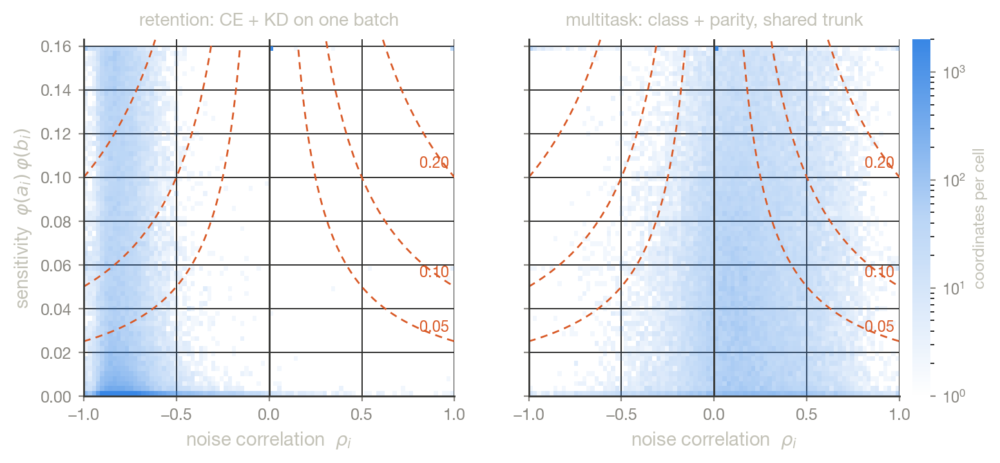
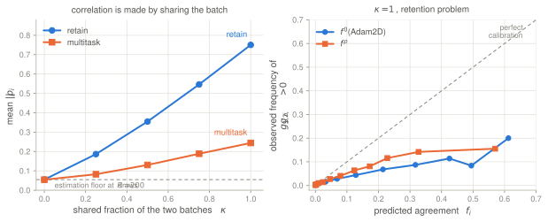
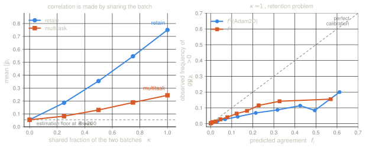

The [Adam2D post](../2026-08-03-two-dimensional-adam/) builds a per-coordinate
gate $f_i$ from the probability that two tasks' *true* gradients agree in sign,
given what a batch measured. It assumes the two measurement noises are
independent. That assumption holds exactly when the two losses are evaluated on
two batches drawn independently — and fails whenever they are evaluated on the
same one.

Which is the ordinary case. Fit the new data and stay close to the old model;
follow preferences and stay capable; predict the label and predict the auxiliary
target. In all of these, one batch goes forward and two losses come back. The two
gradient estimates are then two functions of a single random draw, and their
noises are correlated by construction.

> Adam2D believed it was measuring two independent gradients. It is usually
> measuring the same batch twice — and the orthant probability, the Plackett
> derivative, the two bounds and the estimator below are what that observation
> forces and what it permits.

This post does the correlated case: the model, the gate, what correlation does to
it, how to estimate the correlation for nothing, and — the part that decides
whether any of it matters — a measurement on two real shared-batch problems. The
short version of that measurement is that the correlation is large ($\overline{|\rho|}
= 0.75$ on a retention pair against an estimation floor of $0.055$), that it is
mostly *negative* there, which is the dangerous sign, and that correcting for it
cuts the gate's calibration error by $43\%$ while leaving its ranking of
coordinates essentially unchanged.

A notational caution, since more than one dependence appears below. $\rho_i$ is
always the **sampling-noise** correlation of coordinate $i$ — the subject of this
post — and $c_{12,i}$ its unnormalised covariance. The correlation between the
two *true* gradients, i.e. the degree of task conflict, is written $\varrho$; the
Adam2D post called it $\rho_{\mathrm{task}}$.

## The common cause

Let $\ell_1(s;\theta)$ and $\ell_2(s;\theta)$ be per-sample losses and $\hat g_k$
the mean of $\nabla_\theta \ell_k$ over a batch of size $B$. If task 2's batch
shares a fraction $\kappa$ of task 1's samples, then coordinate by coordinate

$$
c_{12,i} \;\doteq\; \mathrm{Cov}(N_{1,i}, N_{2,i})
\;=\; \frac{\kappa}{B}\,
\mathrm{Cov}_s\big(\partial_i \ell_1(s),\, \partial_i \ell_2(s)\big),
\qquad
\rho_i \;=\; \frac{c_{12,i}}{\sigma_{1,i}\sigma_{2,i}},
$$ {#eq-cov}

with $\hat g_k = g_k + N_k$, as in the Adam2D post's measurement model.
Simulated with
per-sample derivatives drawn from a known joint law, $B = 64$, $2\times10^4$
batch draws per row:

| $\kappa$ | empirical $\mathrm{Cov}(N_1,N_2)$ | $\tfrac{\kappa}{B}\mathrm{Cov}_s$ | induced $\rho$ |
|---:|---:|---:|---:|
| $0.25$ | $+0.00224$ | $+0.00234$ | $+0.102$ |
| $0.50$ | $+0.00463$ | $+0.00469$ | $+0.211$ |
| $1.00$ | $+0.00918$ | $+0.00937$ | $+0.420$ |

Nothing here depends on the two losses being related. It is the *sampling* that
is shared, and any pair of per-sample derivatives that co-vary across the data
distribution — which is to say, almost any pair — inherits a correlated batch
noise. Independence is the special case, obtained by paying for two disjoint
batches.

**The prior is untouched.** Writing $C$ for the $2\times2$ per-coordinate noise
covariance, a flat prior gives $g \mid \hat g \sim \mathcal{N}(\hat g, C)$: the
posterior *mean* is still $\hat g$ whatever $C$ is, and only the posterior
covariance changes. This is why the correction below is confined to one formula
— the update rule, the descent argument and the greedy repair all read $f$ as an
opaque non-negative weight and never ask where it came from.

## The gate is an orthant probability

With correlated posterior noise, the probability that the two true gradients
share a sign is no longer a product. Write $a_i = \hat g_{1,i}/\sigma_{1,i}$ and
$b_i = \hat g_{2,i}/\sigma_{2,i}$.

::: {#prp-orthant name="the correlated focus gate"}

&nbsp;

$$
f^{\rho}_i \;=\; \mathbb{P}\!\left[g_{1,i} g_{2,i} > 0 \,\middle|\, \hat g_1, \hat g_2\right]
\;=\; \Phi_2(a_i, b_i; \rho_i) \;+\; \Phi_2(-a_i, -b_i; \rho_i),
$$ {#eq-orthant}

with $\Phi_2(\cdot,\cdot;\rho)$ the standard bivariate normal CDF. The update is
unchanged: $\Delta = -\,f \odot (\alpha \hat g_1 + \beta \hat g_2)$.

:::

This is the formula sketched as Q1 of the Adam2D post; here it is the object of
study rather than an aside. It is cheap in practice because the marginal terms
cancel in Owen's decomposition [@owen1956], leaving two calls to Owen's $T$:

$$
f^{\rho} = \mathbb{1}[ab > 0]
\;-\; 2\,T\!\left(a, \tfrac{b - \rho a}{a\sqrt{1-\rho^2}}\right)
\;-\; 2\,T\!\left(b, \tfrac{a - \rho b}{b\sqrt{1-\rho^2}}\right).
$$ {#eq-owen}

Checked two ways: against direct Monte-Carlo sampling of the posterior, worst
discrepancy $5.7\times10^{-4}$ over six $(a,b,\rho)$ points at $4\times10^5$
draws each — that is the Monte-Carlo standard error, $7.9\times10^{-4}$, not a
bias; and against `scipy`'s bivariate normal CDF over $300$ random arguments,
worst discrepancy $2.2\times10^{-16}$.

What the gate looks like, with the Adam2D gate in the $\rho = 0$ column:

| $(a,b)$ | $\rho = -0.8$ | $-0.4$ | $0$ | $+0.4$ | $+0.8$ |
|---|---:|---:|---:|---:|---:|
| $(0,0)$ | $0.205$ | $0.369$ | $0.500$ | $0.631$ | $0.795$ |
| $(1,1)$ | $0.683$ | $0.696$ | $0.733$ | $0.790$ | $0.878$ |
| $(1,-1)$ | $0.122$ | $0.210$ | $0.267$ | $0.304$ | $0.317$ |
| $(2,0.3)$ | $0.595$ | $0.599$ | $0.613$ | $0.630$ | $0.640$ |
| $(2.5,-2.5)$ | $0.008$ | $0.012$ | $0.012$ | $0.012$ | $0.012$ |

## What correlation does to the gate

Every row of that table increases left to right, and that is a theorem, not an
accident.

::: {#prp-plackett name="monotonicity in the noise correlation"}

&nbsp;

$\partial_\rho \Phi_2(h,k;\rho) = \varphi_2(h,k;\rho)$ [@plackett1954], and
$\varphi_2(-h,-k;\rho) = \varphi_2(h,k;\rho)$, so

$$
\frac{\partial f^{\rho}}{\partial \rho} \;=\; 2\,\varphi_2(a, b; \rho) \;>\; 0
$$ {#eq-plackett}

**everywhere**, including at observed disagreement $ab < 0$.

:::

Checked by central differences at $2000$ random $(a,b,\rho)$: worst discrepancy
against the analytic form $3.2\times10^{-10}$, and the numeric derivative is
positive at every point where the analytic one is above float64 cancellation
noise.

The "including at observed disagreement" is worth dwelling on, because the
tempting intuition points the other way: *negative noise correlation manufactures
apparent disagreement, so on seeing disagreement one should discount it and
raise $f$.* That is wrong, and the $\rho \to -1$ limit shows why. There the
posterior is $g_1 = \hat g_1 + \sigma_1 Z$, $g_2 = \hat g_2 - \sigma_2 Z$: the
two true gradients are perfectly anti-correlated given the data, and the gate
collapses to $|\Phi(b) - \Phi(-a)|$, which is $0$ at $a = -b$. Anti-correlated
noise does not merely fake disagreement in the measurement, it makes the two
posteriors genuinely anti-aligned. Symmetrically, common noise displaces both
posteriors along the diagonal, which *preserves* sign agreement rather than
faking it.

That gives two directed consequences, each testable:

- **Ignoring $\rho > 0$ over-masks.** $f^0 < f^{\rho}$, so the gate closes
  coordinates it should keep. Wasteful, and safe.
- **Ignoring $\rho < 0$ under-masks.** $f^0 > f^{\rho}$: the gate keeps
  coordinates whose true gradients are, given the evidence, more likely opposed
  than it thinks. This is the dangerous direction, and — as measured below — the
  one that actually occurs in the retention setting.

A separate distortion acts one level up, on the measurement itself. Since
$\E[\hat g_{1,i}\hat g_{2,i}] = g_{1,i}g_{2,i} + c_{12,i}$, negative $c_{12}$
biases the observed product toward conflict on coordinates whose true gradients
agree. Simulated at $g_1 g_2 = +0.12 > 0$, $2\times10^5$ draws:

| $\rho$ | $\mathbb{P}[\hat g_1 \hat g_2 < 0]$ | $\E[\hat g_1 \hat g_2]$ | $g_1g_2 + c_{12}$ |
|---:|---:|---:|---:|
| $-0.8$ | $0.690$ | $-0.677$ | $-0.680$ |
| $-0.4$ | $0.573$ | $-0.277$ | $-0.280$ |
| $0.0$ | $0.462$ | $+0.120$ | $+0.120$ |
| $+0.4$ | $0.347$ | $+0.519$ | $+0.520$ |
| $+0.8$ | $0.194$ | $+0.920$ | $+0.920$ |

So $\rho$ corrupts both the input to the gate and the gate's reading of that
input, and the two corruptions are distinct: @eq-plackett fixes the second, while
the first calls for the debiased product $\hat g_{1,i}\hat g_{2,i} - \hat
c_{12,i}$ — an empirical partial correlation, conditioned on the batch. That
debiasing belongs to the certificate rather than the gate, and is picked up in
the open questions.

### Two bounds

The correction has a worst case that needs no per-coordinate estimation at all.

::: {#prp-lemma1 name="uniform bound"}

&nbsp;

$$
\big|f^{\rho} - f^{0}\big| \;\le\; \frac{\arcsin|\rho|}{\pi}
\qquad\text{for all } (a,b),
$$ {#eq-lemma1}

with equality at $a = b = 0$.

:::

*Proof.* Integrate @eq-plackett: $|f^\rho - f^0| = \int_0^{|\rho|}
2\varphi_2(a,b;t)\,dt \le \int_0^{|\rho|} \tfrac{dt}{\pi\sqrt{1-t^2}} =
\tfrac{\arcsin|\rho|}{\pi}$, since $\varphi_2(a,b;t) \le
(2\pi\sqrt{1-t^2})^{-1}$ with equality at $a=b=0$. At that point the gate is
Sheppard's $\tfrac12 + \tfrac{\arcsin\rho}{\pi}$ [@sheppard1899]. $\square$

Numerically, over a $241\times241$ grid on $[-4,4]^2$ and $19$ values of $\rho$,
the bound is attained at $(0,0)$ to $1.4\times10^{-16}$ every time. Because $V$
is linear in $f$, @eq-lemma1 propagates into slack on the feasibility certificate
without estimating a single $\rho_i$: a pooled $\bar\rho = 0.3$ costs at most
$0.097$ in units of focus.

The second bound says where the correction actually lives.

::: {#prp-lemma2 name="localisation"}

&nbsp;

$$
\left.\frac{\partial f^{\rho}}{\partial \rho}\right|_{\rho = 0}
\;=\; 2\,\varphi(a)\,\varphi(b).
$$ {#eq-lemma2}

:::

Immediate from @eq-plackett at $\rho = 0$; checked to $5.1\times10^{-10}$. It is
sharper than "wherever the gate is uncertain": a coordinate with one confident
task and one uncertain one has $f \approx \tfrac12$ but $\varphi(a)\varphi(b)
\approx 0$, so it is $\rho$-robust. The correction concentrates where **both**
tasks are at low SNR. That product is the vertical axis of the figure below, and
despite being a first-order quantity it turns out to predict the measured
deviation within $25\%$ even at $|\rho| = 0.75$.

## Correctness is robust to $\rho$; efficiency is not

::: {.callout-note}
## The separation worth stating once

The [certification post](../2026-08-04-certifying-two-task-steps/) shows that
$V(f) \le 0$, with $V = -\tilde S_{12} - \min(\tfrac{\alpha}{\beta}\tilde
S_{11}, \tfrac{\beta}{\alpha}\tilde S_{22})$, holds **if and only if** the gated
step is a descent direction for both measured gradients. That statement is
algebraic in $f$: it needs only $f \ge 0$ and measurability, never where $f$ came
from.

So a badly estimated $\rho$ cannot invalidate a certificate. Whatever $f$ you
build, $V(f) \le 0$ certifies the step you are actually taking against the batch
you actually measured. What a badly estimated $\rho$ costs is **efficiency**: a
gate that misjudges agreement masks the wrong coordinates, fails the test more
often, and spends the repair budget needlessly.

*Correctness robust to $\rho$; efficiency sensitive to $\rho$.* This is also why
the correlated case does not require re-deriving anything in the certification
post — only re-reading $f$.
:::

One thing does break. The Adam2D descent proof leans on the pivot $f_i \ge
\tfrac12 \Leftrightarrow \hat g_{1,i}\hat g_{2,i} > 0$, which gives the pathwise
bound $\tilde S_{12} \ge \tfrac12 \langle \hat g_1, \hat g_2\rangle$. Under
correlation the neutral level moves to $\tfrac12 + \tfrac{\arcsin\rho_i}{\pi}$
and the pivot fails. The route through $V$ is unaffected, which is the practical
reason to prefer it.

## Estimating $\rho$ costs nothing

The noise scales in Adam2D already come from splitting the batch into $k$
micro-batches and taking the standard error of the mean. Evaluate *both* losses
on each of those same $k$ splits — aligned, not independently resampled — and the
cross-covariance falls out of buffers already in memory:

$$
\hat c_{12,i} = \frac{1}{k(k-1)}\sum_{j=1}^{k}
\big(g^{(j)}_{1,i} - \hat g_{1,i}\big)\big(g^{(j)}_{2,i} - \hat g_{2,i}\big),
\qquad
\hat\rho_i = \frac{\hat c_{12,i}}{\hat\sigma_{1,i}\hat\sigma_{2,i}}.
$$ {#eq-est}

No extra backward pass: a two-task step that micro-batches for $\sigma$ already
runs $2k$ sub-batch backwards, and alignment is a choice about *which samples*
each split uses, not about how many passes to make. The one requirement is that
the alignment be maintained, which costs an index bookkeeping.

How good is it? Below, $\hat\rho$ at $k = 8$ is scored against a reference: the
empirical correlation of the batch-mean gradients over $R = 200$ independently
drawn batches at frozen $\theta$, which is the estimand itself.

| | retention pair | multitask pair |
|---|---:|---:|
| $\mathrm{corr}(\hat\rho, \rho_{\mathrm{ref}})$ | $0.568 \pm 0.007$ | $0.375 \pm 0.013$ |
| bias $\E[\hat\rho - \rho_{\mathrm{ref}}]$ | $+0.010 \pm 0.003$ | $+0.013 \pm 0.006$ |
| RMSE | $0.231$ | $0.436$ |
| rank version, $\sin(\pi\hat\tau/2)$ [@kruskal1958] | $0.322$ | $0.374$ |
| $\hat\sigma_1 / \sigma_{1,\mathrm{ref}}$ | $0.891$ | $0.818$ |
| $\hat\sigma_2 / \sigma_{2,\mathrm{ref}}$ | $0.898$ | $0.747$ |

Read plainly: at $k = 8$ the estimator is nearly unbiased and carries real
signal, but it is noisy — a correlation of $0.57$ with the truth, not $0.95$. The
rank-based alternative, which one reaches for when the noise is not Gaussian, is
*worse* here, and unsurprisingly: Kendall's $\tau$ on eight points is very
coarse. The variance estimator is also biased low by $10\%$ to $25\%$, the usual
small-sample bias of a standard deviation, which the Adam2D post did not have to
worry about at the accuracy it needed.

## Does it matter?

Everything above is machinery. Whether the machinery earns its place is an
empirical question with two possible answers, both worth publishing: if the
correlation mass sits where the gate is insensitive to it, the result is a
robustness theorem for Adam2D as it stands; if not, Adam2D needs the correction.

The setting is two shared-batch problems on `digits`, same architecture and data
as the earlier posts:

- **retention** — batches are drawn from all ten classes; $L_1$ is
  cross-entropy on the batch and $L_2$ is $\mathrm{KL}(\text{base} \,\|\,
  \text{model})$ on the *same* batch, the base being an MLP pretrained on classes
  0–4. This is the Learning-without-Forgetting construction [@li2018learning],
  and it is antagonistic: the second loss undoes what the first does.
- **multitask** — two heads on a shared trunk, digit class and digit parity, one
  batch. Cooperative. Analysed on the shared trunk, since the heads are private
  to one task each and carry no conflict by construction.

A shared fraction $\kappa$ interpolates: $\kappa = 0$ is exactly the independent
case Adam2D assumes, $\kappa = 1$ the fully shared one. Four seeds, 300 steps,
$d \approx 9000$, reference $\rho$ at 28 checkpoints per run.

Two things make this decidable rather than assumption-bound. The reference $\rho$
above is one. The other is that on `digits` the population loss *is* the
full-dataset loss, so the true gradients are computable exactly — which makes
"the two true gradients agree in sign" an observable label, and $f$, which claims
to be the probability of exactly that event, a forecast that can be scored.

### How much correlation is there

| problem | $\kappa$ | mean $\lvert\rho\rvert$ | median | $q_{90}$ | mean $\rho$ | $\mathbb{P}[\rho<0]$ | mean $\lvert\Delta f\rvert$ | $q_{99}$ | $\lVert\delta\Delta\rVert/\lVert\Delta\rVert$ |
|---|---:|---:|---:|---:|---:|---:|---:|---:|---:|
| retention | $0.00$ | $0.055$ | $0.046$ | $0.116$ | $-0.009$ | $0.53$ | $0.003$ | $0.029$ | $0.9\%$ |
| retention | $0.25$ | $0.186$ | $0.190$ | $0.284$ | $-0.185$ | $0.96$ | $0.010$ | $0.076$ | $3.2\%$ |
| retention | $0.50$ | $0.355$ | $0.369$ | $0.459$ | $-0.353$ | $0.96$ | $0.021$ | $0.130$ | $7.0\%$ |
| retention | $0.75$ | $0.546$ | $0.570$ | $0.656$ | $-0.544$ | $0.97$ | $0.036$ | $0.200$ | $13.4\%$ |
| retention | $1.00$ | $\mathbf{0.751}$ | $0.786$ | $0.867$ | $-0.748$ | $\mathbf{0.97}$ | $0.061$ | $0.305$ | $\mathbf{26.8\%}$ |
| multitask | $0.00$ | $0.054$ | $0.046$ | $0.114$ | $-0.000$ | $0.49$ | $0.007$ | $0.035$ | $1.1\%$ |
| multitask | $0.25$ | $0.082$ | $0.070$ | $0.171$ | $+0.047$ | $0.29$ | $0.010$ | $0.053$ | $1.6\%$ |
| multitask | $0.50$ | $0.130$ | $0.113$ | $0.268$ | $+0.094$ | $0.22$ | $0.016$ | $0.083$ | $2.6\%$ |
| multitask | $0.75$ | $0.188$ | $0.165$ | $0.385$ | $+0.139$ | $0.21$ | $0.023$ | $0.121$ | $3.9\%$ |
| multitask | $1.00$ | $\mathbf{0.244}$ | $0.213$ | $0.500$ | $+0.182$ | $\mathbf{0.21}$ | $0.031$ | $0.168$ | $\mathbf{5.3\%}$ |

The $\kappa = 0$ rows are the control, and they are the reassuring part: mean
$|\rho| = 0.055$, against $\sqrt{2/(\pi R)} = 0.056$, the expected
absolute value of a sample correlation of zero at $R = 200$. Disjoint batches
give independent noise, measurably. **Adam2D is exactly right in the case it
assumes.**

Everything else is the answer to the question. On a shared batch the retention
pair reaches $\overline{|\rho|} = 0.75$, with $97\%$ of coordinates *negative* —
the dangerous sign — and correcting for it moves the update direction by $27\%$
in norm. The multitask pair reaches $0.24$, mostly positive, moving the direction
by $5\%$. Both signs occur in ordinary problems, and the sign is a property of
how the two losses relate, not an artefact.

::: {.light-content}

:::

::: {.dark-content}

:::

*Where the correlation sits, against where the gate is sensitive to it. Each cell
is a count of coordinate-checkpoints at $\kappa = 1$. The vertical axis is the
Lemma-2 sensitivity $\varphi(a_i)\varphi(b_i)$; dashed curves are iso-deviation
contours $2|\rho|\varphi(a)\varphi(b) = c$ for $c \in \{0.05, 0.10, 0.20\}$. The
retention pair piles up against $\rho = -0.8$ across the whole sensitivity range;
$24\%$ of its mass has $|\rho| > 0.5$ together with $\varphi\varphi > 0.05$. The
bright row at the bottom is the high-SNR coordinates, which are $\rho$-robust
whatever $\rho$ is.*

The two bounds hold up as advertised, the uniform one loosely and the local one
tightly:

| problem | measured mean $\lvert\Delta f\rvert$ | Lemma 1 (uniform) | Lemma 2 (local) | ratio to Lemma 2 |
|---|---:|---:|---:|---:|
| retention | $0.061$ | $0.272$ | $0.049$ | $1.25$ |
| multitask | $0.031$ | $0.079$ | $0.030$ | $1.04$ |

Lemma 1 is a supremum over $(a,b)$, so being $4.4\times$ above the mean is
expected rather than disappointing — it is the price of not estimating anything.
Lemma 2 predicting the mean deviation to within $25\%$ at $|\rho| = 0.75$ is the
surprise: a derivative taken at $\rho = 0$ has no business being that accurate
three-quarters of the way to $\rho = -1$, and it means the cheap diagnostic
$\overline{|\rho|\varphi(a)\varphi(b)}$ is enough to decide whether the
correction is worth running at all.

::: {.light-content}

:::

::: {.dark-content}

:::

*The table above drawn, and the one below. Left: the correlation is made by
sharing the batch, not by the tasks being related — both curves start at the
estimation floor of the $\kappa = 0$ control. Right: reliability of the two
gates on the retention pair, predicted agreement against observed frequency.
Both sit far below the diagonal, so both are overconfident; $f^{\rho}$ is less
so, and its predictions do not reach as far right.*

### Is the corrected gate a better forecast?

$f$ claims to be $\mathbb{P}[g_1 g_2 > 0 \mid \hat g]$. The label is observable
here, so score it. At $\kappa = 1$:

| problem | gate | Brier | ECE | AUC | error of $f > \tfrac12$ |
|---|---|---:|---:|---:|---:|
| retention | constant base rate | $0.0493$ | | | |
| retention | $f^0$, flat prior (Adam2D) | $0.0908$ | $0.140$ | $0.774$ | $11.2\%$ |
| retention | $f^{\rho}$, flat prior | $\mathbf{0.0659}$ | $\mathbf{0.080}$ | $0.770$ | $\mathbf{6.7\%}$ |
| retention | $f^0$, shrunk prior | $0.0921$ | $0.147$ | | |
| retention | $f^{\rho}$, shrunk prior | $0.0655$ | $0.082$ | | |
| retention | $f^{\rho}$, free estimator $\hat\rho$ | $0.0673$ | | $0.762$ | |
| multitask | constant base rate | $0.2475$ | | | |
| multitask | $f^0$, flat prior (Adam2D) | $0.2677$ | $0.140$ | $0.569$ | $43.6\%$ |
| multitask | $f^{\rho}$, flat prior | $0.2649$ | $0.138$ | $0.585$ | $42.1\%$ |
| multitask | $f^0$, shrunk prior | $0.2451$ | $0.052$ | | |
| multitask | $f^{\rho}$, shrunk prior | $\mathbf{0.2375}$ | $0.050$ | | |
| multitask | $f^{\rho}$, free estimator $\hat\rho$ | $0.2758$ | | $0.576$ | |

Five things in that table, three of them uncomfortable.

**The correction is a calibration fix, not a ranking fix.** On the retention pair
ECE falls from $0.140$ to $0.080$, a $43\%$ cut, and the error rate of the hard
decision $f > \tfrac12$ falls from $11.2\%$ to $6.7\%$, a $40\%$ cut. But AUC is
flat, $0.774$ against $0.770$. Correcting for $\rho$ barely changes which
coordinates the gate ranks as trustworthy; it changes how much it trusts them.
Since the gate is used as a multiplier and not as a ranking, that is the useful
kind of improvement — but it should be said in those terms and not as "the gate
now finds better coordinates".

**A constant beats both gates on Brier for the retention pair** — $0.0493$
against $0.0659$ — because the base rate there is $5.3\%$ and predicting $0.053$
everywhere is hard to beat on a squared-error score. That constant is useless as
a gate, which is what the AUC column is for; but the comparison belongs in the
table, since a Brier improvement over a bad baseline is not evidence of much.

**The free estimator recovers most of the gain, and on the multitask pair it
loses money.** Retention: Brier $0.0673$ with $\hat\rho$ against $0.0659$ with
the reference, versus $0.0908$ uncorrected — so about $94\%$ of the available
improvement survives estimation. Multitask: $0.2758$ with $\hat\rho$ against
$0.2677$ *uncorrected*. There, $\hat\rho$'s RMSE of $0.44$ exceeds the typical
$|\rho|$ of $0.24$, and plugging noise into @eq-orthant costs more than the
correction buys. The honest rule that follows is a precondition, not a
recommendation: **correct when the estimated correlation is large relative to its
own error, and not otherwise.** Lemma 2 gives the diagnostic for free.

**Prior and correlation are separate miscalibrations of different sizes.** On the
multitask pair the prior shrinkage of the Adam2D post does most of the work
($0.2677 \to 0.2451$) and $\rho$ adds a little on top ($\to 0.2375$); on the
retention pair the ordering reverses and shrinkage does nothing ($0.0908 \to
0.0921$). Neither correction substitutes for the other.

**Both gates remain overconfident.** The right-hand figure is not a picture of a
solved problem: on the retention pair a predicted $0.6$ corresponds to an
observed $0.2$. The correction moves in the right direction and does not finish
the job — consistent with the Adam2D post's own finding that the flat prior is
badly calibrated at low SNR, on a problem where nearly every coordinate is at low
SNR.

### The two directed predictions

Both hold, on both problems, with the signs the theory demands:

| | retention | multitask |
|---|---:|---:|
| mean $(f^{\rho} - f^0)$ where $\rho > 0$ | $+0.057 \pm 0.007$ | $+0.036 \pm 0.001$ |
| mean $(f^{\rho} - f^0)$ where $\rho < 0$ | $-0.063 \pm 0.001$ | $-0.019 \pm 0.001$ |
| observed agreement among truly-agreeing coordinates, $\rho > 0$ | $0.666$ | $0.622$ |
| … same, $\rho < 0$ | $0.279$ | $0.519$ |

The last two rows are @eq-cov's consequence on real gradients, and the size of it
is the part I did not expect: on the retention pair, a coordinate whose true
gradients agree is *observed* to agree $67\%$ of the time when its noise
correlation is positive and $28\%$ of the time when it is negative. The
measurement is not a noisy view of the truth so much as a differently-signed one.

### What it costs the certificate

Recomputing the level-(i) violation along the same trajectory, as a passive
diagnostic — the run is driven by $f^0$ throughout, so these are the same batches
seen two ways:

| problem | $V(f^0) > 0$ | $V(f^{\rho}) > 0$ | sign disagreement |
|---|---:|---:|---:|
| retention | $22.3\%$ | $10.7\%$ | $11.6\%$ |
| multitask | $0.0\%$ | $0.0\%$ | $0.0\%$ |

The deployed gate fails the feasibility test twice as often as the correct one
would, which is the efficiency cost of ignoring $\rho < 0$ made concrete: those
extra batches send the $\ell_1$-minimal repair to work needlessly. Both columns
are valid certificates of their own update — that is the separation stated above
— but one of them is throwing coordinates away for no reason. Note also that the
$22.3\%$ here is far above the $9.3\%$ the certification post measured, on a
problem where the batches were disjoint; shared batches make the certificate
fire more.

## The algorithm, and what it costs

```text
Correlated Adam2D -- one step

Require: aligned micro-batches; alpha, beta > 0; relative margin tau_rel; eta

  for j = 1..k:                              # the passes you already make
      g1[j] <- grad L1 on split j
      g2[j] <- grad L2 on the SAME split j   # alignment is the whole trick
  ĝk, σk  <- mean and s.e.m. over j
  ĉ12     <- cross-covariance over j         # free: buffers already in memory
  ρ̂       <- ĉ12 / (σ1 σ2)
  a, b    <- ĝ1/σ1, ĝ2/σ2
  f       <- 1{ab>0} − 2T(a, (b−ρ̂a)/(a√(1−ρ̂²))) − 2T(b, (a−ρ̂b)/(b√(1−ρ̂²)))
  ---- from here, the certification post's step, unchanged ----
  compute S̃11, S̃22, S̃12 ; budget ; guard-rail ; V(f)
  if V(f) > −tau: greedy l1-minimal repair on s̃ = f (ĝ1ĝ2 + (alpha/beta) ĝ1²)
  Δ  <- −(m ⊙ f) ⊙ (alpha ĝ1 + beta ĝ2)
  θ  <- Optimize(θ, Δ, eta)
```

Only the block above the rule differs from Adam2D; everything below it is the
[certification post](../2026-08-04-certifying-two-task-steps/)'s step verbatim,
since none of it inspects how $f$ was built.

The cost is elementwise and scale-free. Ratios against a gradient evaluation are
deliberately not quoted, since at these sizes they measure numpy temporaries
against fused backward kernels rather than the method; what is stable is:

| item | per coordinate | ratio |
|---|---:|---:|
| gate $f^0$ — two `erf`, $\mathcal{O}(d)$ | $25$ ns | $1\times$ |
| gate $f^{\rho}$ — two Owen's $T$, $\mathcal{O}(d)$ | $107$ ns | $4.2\times$ |
| $\hat g_k, \hat\sigma_k$ from $k$ splits, $\mathcal{O}(kd)$ | $29$ ns | — |
| cross-covariance $\hat c_{12}$, same splits, $\mathcal{O}(kd)$ | $20$ ns | $0.67\times$ the above |
| whole correlated gate / whole plain gate | | $\approx 2.9\times$ |

So the correlated gate is about three times the arithmetic of the independent
one, on a term that was already a small fraction of a step, and **zero** extra
passes over data. The structural claim of Adam2D — no gradient a two-task method
has not already computed — survives intact.

## Degeneracies

Everything reduces where it should, and every row below is checked numerically
to $\le 4.4\times10^{-16}$ — except the $C \to 0$ row, where convergence is
pointwise, so a coordinate whose measured gradient sits at zero needs a smaller
noise scale to get there.

| limit | the gate becomes |
|---|---|
| $\rho = 0$, flat prior | $\tfrac12(1 + \psi_1\psi_2)$ — Adam2D as published |
| $\rho = 0$, proper prior | the $\lambda$-shrunk version, two tests (below) |
| $C \to 0$ | the hard AND-mask on measured gradients, for $ab \ne 0$ — the deterministic world of the [$\ell_1$ post](../2026-07-23-l1-gradient-masking/) |
| $\rho \to 1$, equal $\sigma$ | $\Phi(\min(a,b)) + 1 - \Phi(\max(a,b))$ |
| $\rho \to -1$ | $\lvert\Phi(b) - \Phi(-a)\rvert$; zero at $a = -b$ |
| $a = b = 0$ | $\tfrac12 + \tfrac{\arcsin\rho}{\pi}$ [@sheppard1899] |
| prior scale $\to \infty$ | back to the flat prior |

## Where a proper prior enters

With $g_{k,i} \sim \mathcal{N}(0, \tau_{k,i}^2)$ the posterior mean becomes
$\lambda_{k,i}\hat g_{k,i}$, $\lambda = \tau^2/(\tau^2+\sigma^2)$, and $a, b$
pick up the shrinkage factors $c_k = \tau_k/\sqrt{\tau_k^2+\sigma_k^2}$ of the
Adam2D post's [calibration
section](../2026-08-03-two-dimensional-adam/#calibration-is-where-the-prior-shows-up).
Nothing in @eq-orthant changes but its arguments. What does change, at level (ii) only, is
that the two descent conditions carry different $\lambda$s on the cross term, so
the single scalar $V$ ceases to exist and the masking problem becomes
bi-constrained. That is the subject of the certification post's [last
section](../2026-08-04-certifying-two-task-steps/#where-the-single-test-breaks)
and nothing here alters it: the split is caused by heterogeneous priors, not by
$\rho$, and level (i) never sees either.

The measurement above says the two corrections are worth keeping separate. They
are not competing fixes for one defect; they are two defects, and which dominates
depends on the problem.

## Mutual information: what it can and cannot do

In the Gaussian case $I(N_1; N_2) = -\tfrac12 \log(1 - \rho^2)$, which is an
*unsigned* reparametrisation of $\rho$. Since the entire content of
@eq-plackett is that the sign of $\rho$ decides the direction of the correction,
mutual information cannot drive the correction. It has three honest roles.

As a **misspecification budget**: combining $|\rho| = \sqrt{1 - e^{-2I}}$ with
@eq-lemma1 gives $|f^{\rho} - f^0| \le \pi^{-1}\arcsin\sqrt{1-e^{-2I}}$, a bound
on how wrong an independence assumption can be, in terms of a quantity that is
sometimes easier to bound than $\rho$ itself.

As a **conceptual separation**, which is the role I find most useful: conflict is
a task-level dependence, $\rho$ is a sampling-level dependence, the observed
product $\hat g_1 \hat g_2$ mixes the two, and the correlated theory is the
machinery that separates them. The debiased product $\hat g_1\hat g_2 - \hat
c_{12}$ is exactly that separation made computable.

As a **geometric remark**: at equal $\sigma$, the common and differential modes
$(N_1 \pm N_2)/\sqrt2$ are independent with variances $1 \pm \rho$, so
correlation is a rotation and rescaling of the noise ellipse, and $f$ is asking
which quadrant a point falls in after that rotation. Outside the Gaussian family
it is the copula that carries $f$, which is what makes a rank-based estimator the
natural fallback — even though, at $k = 8$, it measured worse than the moment
one.

## Outlook: correlated *tasks*, not correlated noise {#outlook}

Everything above keeps the prior independent across tasks. The obvious next step
is to let it correlate — $\mathrm{Cov}(g_{1,i}, g_{2,i}) = \varrho_i \tau_{1,i}
\tau_{2,i}$ — and the posterior mean then stops being a per-task shrinkage and
becomes a $2\times2$ Wiener filter [@wiener1949] per coordinate: $\E[g_1 \mid
\hat g]$ mixes $\hat g_1$ *and* $\hat g_2$.

The consequence is structural rather than cosmetic. The update acquires
heterogeneous effective weights $(\alpha_i', \beta_i')$, and once the weights
vary by coordinate, expanding $\Delta$ against $\hat g_1$ and $\hat g_2$ no
longer produces two expressions sharing a single cross term — so the single
scalar $V$ fails at **level (i)**, not just at level (ii). The multi-constraint
regime, which heterogeneous priors reach at the level of expectations and which
$n > 2$ tasks reach natively, would then have arrived at the batch-certificate
level too.

I have not done this, and it should not be attempted before the bi-constrained
question of the certification post is settled, since the same obstruction sits
underneath all three. It is listed here because it explains why that
question is on the critical path rather than a loose end: it is the same problem
arriving from three directions.

## Open questions

- **Q1. Should the certificate use the debiased product?** At level (ii),
  $\E[\tilde S_{12}]$ inherits the bias $\sum_i f_i c_{12,i}$, which the
  retention measurement says is large and negative — so the hypothesis
  $\E[\tilde S_{12}] \ge 0$ is being tested against a systematically pessimistic
  statistic. Substituting $\hat g_{1,i}\hat g_{2,i} - \hat c_{12,i}$ is a
  one-line change with an estimated quantity already in hand. What it does to the
  trigger rate, and whether it can be done without breaking the exactness of the
  greedy's score, I have not worked out.
- **Q2. How many micro-batches does $\hat\rho$ deserve?** At $k = 8$ the
  estimator helps on one problem and hurts on the other. $k$ trades against the
  micro-batch size at fixed cost, and the optimum is presumably where $\hat\rho$'s
  RMSE crosses the typical $|\rho|$ — a shrinkage estimator toward a pooled
  per-layer $\bar\rho$ is the obvious repair and is untested.
- **Q3. Does the sign of $\rho$ predict anything about the task pair?** The two
  problems here split cleanly: antagonistic losses on a shared batch gave
  $\rho < 0$ on $97\%$ of coordinates, cooperative ones gave $\rho > 0$ on
  $79\%$. If that holds generally, the sign of $\bar\rho$ is a free diagnostic
  for "are these two objectives fighting", available before any conflict shows up
  in the aggregate inner product.
- **Q4. The PAC level.** Choosing $\tau$ from $\mathrm{sd}(V)$, estimated by a
  jackknife over the same aligned micro-batches with $f$ recomputed inside the
  loop, is implementable and untested; it belongs to the certification post's Q2
  and inherits the correlated $f$ unchanged.

## Reproducing

In this post's directory: `orthant.py` implements the gate and runs every
analytic check quoted above (generative model, orthant formula against
Monte-Carlo, Owen's $T$ against `scipy`, Plackett, both lemmas, the degeneracy
table); `measure.py` runs the two shared-batch problems, the $\kappa$ sweep, the
reference correlation and all the scoring; `cost.py` times the gate;
`make_figures.py` draws the two figures from `measure_results.npz`. `measure.py`
imports the model and data from the [Adam2D
post](../2026-08-03-two-dimensional-adam/)'s `experiment.py`. About five minutes
on CPU in total.

## References

::: {#refs}
:::
