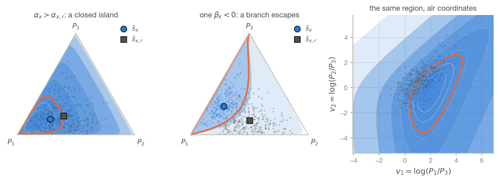
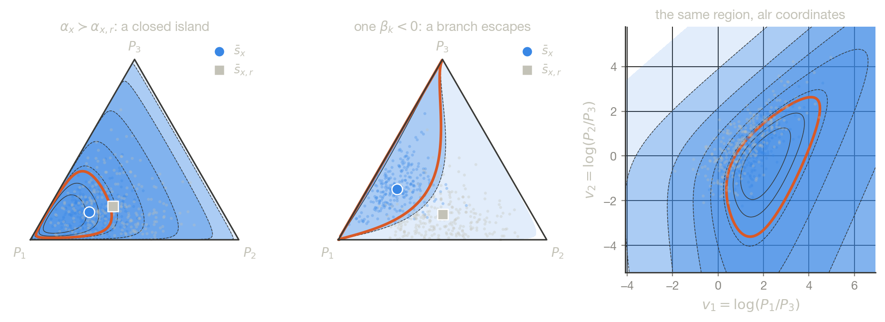
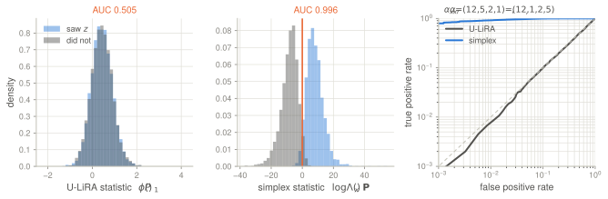
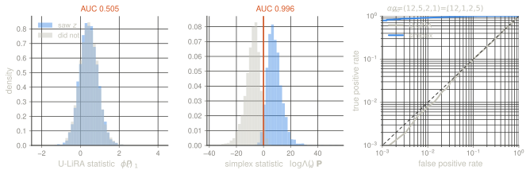
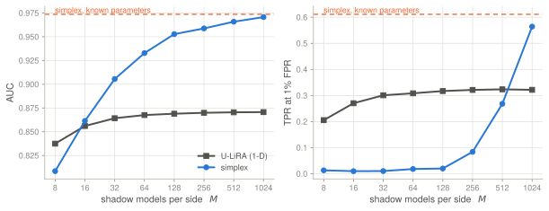
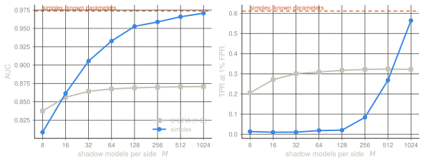
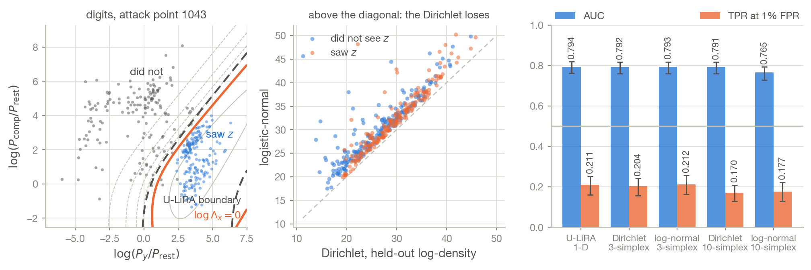
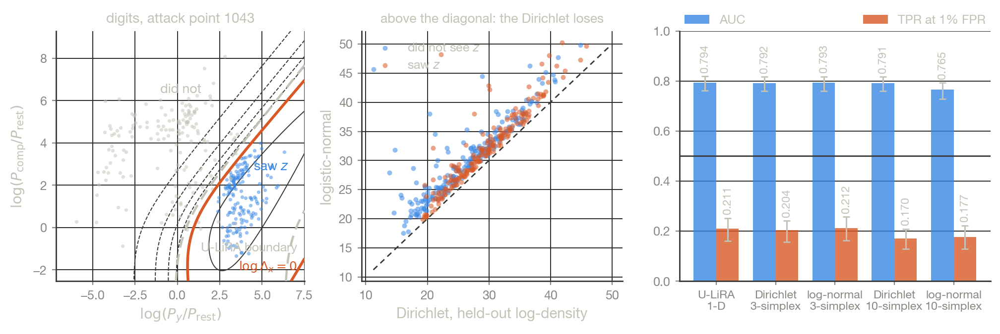

An unlearning audit asks whether a released model still carries a particular
record. U-LiRA [@hayes2024inexact] answers it the way LiRA does
[@carlini2022membership]: reduce each shadow model to one number — the
logit-scaled probability it assigns to the correct class at the attack point —
fit a Gaussian on each side, threshold the likelihood ratio.

The model, though, does not return one number. It returns a probability vector.
Everything the audit discards lives in the other $C-1$ coordinates, and by data
processing, discarding it can only cost. This post works out what the
likelihood-ratio test looks like when nothing is discarded and both sides are
modelled by a Dirichlet: the closed form, the geometry of the decision boundary,
what the extra dimensions can buy, what they cost to estimate, and what happens
when the whole thing is run on real shadow models.

> Under a Dirichlet model of each side, the log-likelihood ratio is **affine in
> $\log \mathbf{P}$**. Its level sets are generalised hyperbolas on the simplex
> and hyperplanes in log coordinates; the member region is convex in Aitchison
> coordinates whenever $\nu_x \ge \nu_{x,r}$, and bounded exactly when
> $\alpha_x \succ \alpha_{x,r}$ coordinatewise. That geometry is exact. Whether
> it buys an attacker anything is a separate, empirical question, and on the
> pipeline measured here the answer is no.

## From weights to the simplex

Write $\A$ for the learning procedure and $\U$ for the unlearning procedure.
With $\D$ the training set and $z = (x,y)$ the record to forget, three random
elements of the parameter space $\Theta$ matter:

$$
\theta \doteq \A(\D), \qquad
\theta_r \doteq \A(\D \setminus \{z\}), \qquad
\theta_\U \doteq \U(\theta, \{z\}),
$$ {#eq-three-thetas}

with densities $\mathbb{Q}, \mathbb{Q}_r, \mathbb{Q}_\U$. An attacker who
observes the released $\theta_\U$ and wants to know whether $z$ was ever there
is running Neyman–Pearson between $\mathbb{Q}$ and $\mathbb{Q}_r$:

$$
\Lambda(\tilde\theta) \doteq
\frac{\mathbb{Q}(\tilde\theta)}{\mathbb{Q}_r(\tilde\theta)} .
$$ {#eq-weight-lr}

Two remarks before specialising. First, this is a white-box statistic, and under
Langevin dynamics with a cross-entropy loss [@raginsky2017langevin] it collapses
to a black-box one:
$\Lambda(\tilde\theta) \propto \mathbb{P}(y \mid x; \tilde\theta)$, the released
model's own confidence at the forgotten point. Nothing about the weights beyond
that confidence is needed, which is the reason to develop the black-box case
properly rather than as a weakened version of a white-box attack. Second, *which
two distributions* belong in @eq-weight-lr is a genuine question and not the one
this post is about — [an earlier note](../2026-08-03-unlearning-aware-dp/) argues
that $\mathbb{Q}_r$ is the wrong denominator because it differs from the
numerator by a procedure as well as by a record. Everything below is indifferent
to that choice: it concerns the shape of the test, not the identity of the two
populations being separated.

Now fix an attack point $x$ and let $\Pi_x : \Theta \to \Delta_C$ send
parameters to the output probability vector at $x$. Pushing the two hypotheses
through gives two densities on the simplex,

$$
\rho_x \doteq \Pi_x(\mathbb{Q}), \qquad \rho_{x,r} \doteq \Pi_x(\mathbb{Q}_r),
$$ {#eq-pushforward}

and the attacker who sees only
$\mathbf{P}_\U(x) = \mathbb{P}(\cdot \mid x; \theta_\U) \in \Delta_C$ thresholds

$$
\Lambda_x(\mathbf{P}) \doteq
\frac{\rho_x(\mathbf{P}(x))}{\rho_{x,r}(\mathbf{P}(x))} .
$$ {#eq-simplex-lr}

Unlearning gives the attacker something classical MIA does not: a *distribution*
of released models rather than a single sample, so both sides of
@eq-simplex-lr can be estimated by shadow pipelines. And @eq-simplex-lr
dominates the one-dimensional test U-LiRA runs, by data processing on the ROC
[@zhu2025uncertainty] — the correct-class probability $P_y$ is a deterministic
function of $\mathbf{P}$, so no test built on it can have a better ROC than the
optimal test on $\mathbf{P}$, at any operating point.

That statement is about *optimal* tests on each representation. It says nothing
about the two tests people actually run, which are optimal only under their
respective parametric models. Keeping those two claims apart is most of the work
in this post.

## The Dirichlet model, and why it closes

The pushforward densities are not available analytically — shadow pipelines
produce samples on $\Delta_C$, not closed forms — so, following the parametric
tradition of LiRA, model each side. On the simplex the natural first choice is a
Dirichlet, in the mean–precision parametrisation [@minka2000estimating]:

$$
\rho = \mathrm{Dir}(\nu\,\bar{\mathbf{s}}), \qquad
\mathrm{Dir}(\nu\,\bar{\mathbf{s}})[\mathbf{P}] =
\frac{\Gamma(\nu)}{\prod_{k=1}^{C}\Gamma(\nu \bar s_k)}
\prod_{k=1}^{C} P_k^{\nu \bar s_k - 1},
$$ {#eq-dir}

with $\bar{\mathbf{s}} \in \Delta_C$ the prototype the side predicts on average
and $\nu > 0$ the concentration measuring how tightly its shadows agree. Write
$\alpha \doteq \nu \bar{\mathbf{s}}$ for the natural parameter, and
$(\bar{\mathbf{s}}_x, \nu_x)$, $(\bar{\mathbf{s}}_{x,r}, \nu_{x,r})$ for the two
sides.

::: {#prp-closed name="closed-form likelihood ratio"}

For $\mathbf{P} \in \Delta_C$ in the interior,

$$
\log \Lambda_x(\mathbf{P}) =
\nu_{x,r}\,\mathrm{KL}\bigl(\bar{\mathbf{s}}_{x,r} \,\|\, \mathbf{P}\bigr)
- \nu_{x}\,\mathrm{KL}\bigl(\bar{\mathbf{s}}_{x} \,\|\, \mathbf{P}\bigr)
+ \mathrm{K},
$$ {#eq-dir-llr}

with $\mathrm{K}$ independent of $\mathbf{P}$:

$$
\mathrm{K} =
\nu_{x,r}\mathrm{H}(\bar{\mathbf{s}}_{x,r}) - \nu_x \mathrm{H}(\bar{\mathbf{s}}_x)
+ \log\Gamma(\nu_x) - \log\Gamma(\nu_{x,r})
+ \sum_{k=1}^{C}\bigl[\log\Gamma(\alpha_{x,r,k}) - \log\Gamma(\alpha_{x,k})\bigr],
$$ {#eq-dir-cst}

where $\mathrm{H}$ is the Shannon entropy of the prototype.

:::

The proof is two lines and worth writing out, because the second line is the
whole post. Taking logs in @eq-dir,

$$
\log\Lambda_x(\mathbf{P}) =
\underbrace{\sum_{k=1}^{C} \bigl(\alpha_{x,k} - \alpha_{x,r,k}\bigr)\log P_k}_{
\textstyle \langle \boldsymbol\beta,\ \log \mathbf{P}\rangle}
\;+\; \log\frac{\Gamma(\nu_x)}{\Gamma(\nu_{x,r})}
\;+\; \sum_{k=1}^{C}\log\frac{\Gamma(\alpha_{x,r,k})}{\Gamma(\alpha_{x,k})},
$$ {#eq-loglinear}

with $\boldsymbol\beta \doteq \alpha_x - \alpha_{x,r}$; and substituting
$\mathrm{KL}(\bar{\mathbf{s}} \| \mathbf{P}) = -\mathrm{H}(\bar{\mathbf{s}}) -
\sum_k \bar s_k \log P_k$ turns @eq-loglinear into @eq-dir-llr. Both forms are
checked against a direct difference of two `scipy` Dirichlet log-densities in
`llr.py`, agreeing to $1.8 \times 10^{-13}$.

@eq-dir-llr is the reading a person wants: two anchors on the simplex, the seen
prototype and the retrained prototype, each pulling with a strength proportional
to its own concentration, and a release flagged as a member when it sits closer
— in precision-scaled KL — to the seen side. @eq-loglinear is the reading the
geometry wants.

## The geometry

Everything in this section is exact under @eq-dir, and every claim is checked
numerically in `llr.py`.

### The boundary is a generalised hyperbola

@eq-loglinear says the statistic is **affine in $\log\mathbf{P}$**: the residual
after subtracting $\langle\boldsymbol\beta, \log\mathbf{P}\rangle$ does not vary
over the simplex at all — measured spread $2.3\times 10^{-13}$ over random
parameter pairs and random points. So every decision boundary
$\{\log\Lambda_x = \tau\}$ is

$$
\prod_{k=1}^{C} P_k^{\beta_k} = \text{const},
$$ {#eq-monomial}

the level set of a monomial. For $\beta = (1,1,0,\dots)$ that is literally
$P_1 P_2 = c$, a hyperbola; in general it is what one would call a generalised
hyperbola, and a hyperplane once you take logarithms. This is nothing more than
the Dirichlet being an exponential family with sufficient statistic
$\log \mathbf{P}$ — but it is worth saying out loud, because it means the
optimal simplex audit is a **linear classifier on log-probabilities**, not
anything that needs the KL form to compute.

### In Aitchison coordinates the member region is convex

Log-probabilities are the wrong chart: $\log\mathbf{P}$ ranges over a curved
$(C-1)$-dimensional surface. The right one is Aitchison's [@aitchison1982]. Take
additive log-ratio coordinates $v_k = \log(P_k/P_C)$, $k < C$. Then
$\log P_k = v_k - \mathrm{lse}(v, 0)$ and @eq-loglinear becomes

$$
\log\Lambda_x(v) = \langle \boldsymbol\beta_{1:C-1},\, v\rangle
\;-\; \Delta\nu\; \mathrm{lse}(v, 0) \;+\; \text{const},
\qquad \Delta\nu \doteq \nu_x - \nu_{x,r} .
$$ {#eq-alr}

Log-sum-exp is convex, so:

- **$\Delta\nu = 0$** — the two sides equally concentrated — the statistic is
  *exactly linear* in $v$. The audit is a hyperplane in Aitchison geometry, the
  compositional analogue of LiRA's equal-variance case.
- **$\Delta\nu > 0$** — the seen side sharper, which is the typical case and
  holds at $94.5\%$ of real attack points below — the statistic is **concave**,
  so $\{\log\Lambda_x \ge \tau\}$ is a **convex** set for every $\tau$.
- **$\Delta\nu < 0$** the statistic is convex and the member region is the
  complement of a convex set: it wraps around the retrained side rather than
  enclosing the seen one.

Midpoint concavity is checked on 400 random parameter pairs: the worst gap when
$\nu_x \ge \nu_{x,r}$ is $+1.0\times 10^{-7}$, and the best gap in the other
regime is $-0.41$, so the dichotomy is sharp and not an artefact of the draws.

### Bounded exactly when $\alpha_x \succ \alpha_{x,r}$

@eq-alr also settles when the member region is an island rather than an
unbounded branch. Along a ray $t \mapsto t\,d$ the statistic behaves like
$t \sum_k \beta_k (d_k - \max_j d_j)$, with $d_C = 0$, which is negative for
every $d \ne 0$ if and only if every $\beta_k$ is strictly positive.

::: {#prp-bounded name="bounded member region"}

Every superlevel set $\{\log\Lambda_x \ge \tau\}$ is bounded in alr coordinates
if and only if $\alpha_{x,k} > \alpha_{x,r,k}$ for all $k$ — the seen-side
Dirichlet dominates the retrained one coordinatewise. If some $\beta_j < 0$, a
branch escapes toward the face $P_j \to 0$.

:::

Criterion against ray-marching: agreement on $300/300$ random pairs.

The escaping branch is not a curiosity. It says that when the retrained side
puts *more* mass than the seen side on some class $j$, releases that suppress
class $j$ arbitrarily hard are flagged as members no matter what they do
elsewhere. An unlearning method that overshoots — that pushes the forgotten
point's residual mass away too aggressively — walks straight into that branch.
Whether that is the Streisand effect made geometric, or an artefact of
extrapolating a Dirichlet fit into a region where no shadow ever went, is not
something this post settles. Realistically it is mostly the latter, and I would
not trust an audit whose verdict rests on the far end of an unbounded branch.

::: {.light-content}

:::

::: {.dark-content}

:::

*The test on the 2-simplex, both regimes. Shading is $\log\Lambda_x$ with levels
spaced logarithmically below its maximum; the thick curve is
$\log\Lambda_x = 0$; dots are $260$ draws from each side. Left:
$\alpha_x = (10, 3.2, 2.4) \succ \alpha_{x,r} = (4.4, 2.6, 1.6)$, so the member
region closes into an island around the seen prototype. Middle:
$\alpha_x = (9, 2.2, 4.4)$ against $\alpha_{x,r} = (4.6, 4.6, 1.5)$ has
$\beta_2 = -2.4 < 0$ and a branch runs off to the edge $P_2 = 0$. Right: the
left-hand case in additive log-ratio coordinates, where the same region is
convex and its level sets are nested — with $\Delta\nu = 0$ they would be
parallel straight lines.*

### What this says about one-sided thresholds

Set $C = 2$ and write $\varphi = \log(P_1/P_2)$. @eq-alr reads
$\beta_1 \varphi - \Delta\nu \log(1 + e^{\varphi})$, a linear term minus a
softplus. When $\beta_1, \beta_2 > 0$ it is unimodal in $\varphi$ and the
acceptance region is an **interval**, not a half-line: a release can be flagged
as a non-member for being too *unconfident* as well as for being too confident.
LiRA's Gaussian ratio on the same $\varphi$ is a quadratic and gives an interval
too, whenever the two fitted variances differ. So in the binary case the
Dirichlet test and U-LiRA are two different shapes on the same axis, not a
richer test against a poorer one. The genuine difference only appears at
$C > 2$, and it is a difference of *dimension*.

## Estimating the two sides

Given shadow softmax outputs $\{\mathbf{s}^{(m)}(x)\}_{m=1}^{M}$, moment
matching is closed-form. Since $\mathrm{Var}(P_k) = \bar s_k(1 - \bar s_k)/(\nu+1)$
under @eq-dir, every coordinate gives an estimate of $\nu + 1$:

$$
\bar{\mathbf{s}} = \frac{1}{M}\sum_m \mathbf{s}^{(m)}(x), \qquad
\hat\nu = \frac{1}{C}\sum_{k=1}^{C}
\frac{\bar s_k(1 - \bar s_k)}{\widehat{\mathrm{Var}}(s_k(x))} - 1 ,
$$ {#eq-mom}

applied separately to shadows that saw $z$ and shadows that did not. Minka's
variant, a geometric rather than arithmetic mean of the $C$ per-coordinate
estimates of $\nu$, is the one used everywhere below; at $C = 6$, $M = 256$,
$\nu = 40$ it gives $40.16 \pm 1.59$ against $40.31 \pm 1.60$ for @eq-mom.

::: {.callout-warning collapse="false"}
## Normalisation, not a detail

The draft I am lifting this from writes @eq-mom with $\tfrac{1}{C-1}$ in front
of a sum over all $C$ coordinates. That is a mismatched pair: the sum has $C$
terms, each estimating $\nu + 1$, so the estimator converges to
$(C\nu + 1)/(C-1)$, not $\nu$. At $C = 6$, $\nu = 40$ the predicted bias is
$+8.2$ and the measured one is $+8.57$. Minka's $\tfrac{1}{K-1}$ is a mean over
$K-1$ coordinates, one having been dropped as redundant under
$\sum_k P_k = 1$; either drop a coordinate or divide by $C$, not both halves of
different conventions.
:::

## What the extra dimensions can buy

Here is the strict half of the data-processing inequality, made concrete. Take
$C = 4$ and

$$
\alpha_x = (12, 5, 2, 1), \qquad \alpha_{x,r} = (12, 1, 2, 5),
$$ {#eq-blindspot}

with class $1$ correct. The marginal of $P_1$ under $\mathrm{Dir}(\alpha)$ is
$\mathrm{Beta}(\alpha_1, \nu - \alpha_1)$, and both sides here have
$\alpha_1 = 12$ and $\nu = 20$: the correct-class probability has **exactly the
same distribution** under both hypotheses. No statistic of $P_1$ alone can
separate them, whatever model is fitted to it and however many shadows are used.
The two sides differ entirely in where the residual $1 - P_1$ sits, and
$\boldsymbol\beta = (0, 4, 0, -4)$, so the optimal test is a threshold on
$\log(P_2/P_4)$ — a hyperplane in Aitchison coordinates through the $P_1$
direction.

Measured on $4000$ releases per side: U-LiRA gets AUC $0.505$ and TPR $0.9\%$ at
$1\%$ FPR, which is chance to three digits. The simplex test gets AUC $0.996$
and TPR $91.9\%$.

::: {.light-content}

:::

::: {.dark-content}

:::

*A pair of sides on which the correct-class statistic is exactly uninformative
and the simplex is nearly conclusive. Left: the U-LiRA statistic
$\phi(P_1) = \log \frac{P_1}{1-P_1}$, same $\mathrm{Beta}(12,8)$ marginal by
construction. Middle: the Dirichlet log-likelihood ratio on the full vector, with
the $\log\Lambda_x = 0$ threshold marked. Right: both ROCs on log-log axes.*

This is a construction, not a measurement — it shows the gap is not zero, not
that it is large anywhere in particular. Whether real unlearning pipelines
produce sides that differ off the correct-class axis is exactly the question the
last section puts to the test.

## What they cost

The simplex test estimates $2C$ parameters where U-LiRA estimates $4$, from the
same shadows. To price that, a population of $500$ attack points at $C = 10$,
each with a retained side and a seen side that differ both in correct-class
confidence and in where the residual mass sits, scored against an oracle that
knows the true parameters.

::: {.light-content}

:::

::: {.dark-content}

:::

*Synthetic Dirichlet ground truth, $C=10$, $500$ attack points, $60$ releases per
side per point, scores pooled across points. The dashed line is the simplex test
with the true parameters — the ceiling that estimation is trying to reach.*

Two crossovers, and they are in very different places.

| $M$ | 8 | 16 | 32 | 64 | 128 | 256 | 512 | 1024 | oracle |
|---|---:|---:|---:|---:|---:|---:|---:|---:|---:|
| AUC, U-LiRA | .838 | .856 | .864 | .868 | .869 | .870 | .871 | .871 | — |
| AUC, simplex | .809 | .861 | .906 | .933 | .953 | .959 | .966 | .971 | .974 |
| TPR@1%, U-LiRA | .206 | .270 | .301 | .308 | .317 | .321 | .324 | .322 | — |
| TPR@1%, simplex | .013 | .010 | .010 | .018 | .020 | .084 | .268 | .564 | .611 |

By AUC the simplex test overtakes at $M \approx 16$ and is far ahead by $M=64$.
At $1\%$ FPR — the regime that actually matters for a privacy claim
[@carlini2022membership] — it is *catastrophically worse* until $M \approx 256$
and does not overtake until somewhere between $512$ and $1024$ shadows per side.
The reason is that a bad $\hat\nu$ scales the whole statistic, and the tail of
the score distribution is where a scale error does its damage; AUC, being a rank
statistic pooled over points, barely notices. **An audit that reports AUC will
conclude the simplex test is better at $M=32$ and be wrong about the number it
was commissioned to produce.**

Also worth recording from this population: only $10\%$ of the attack points have
$\alpha_x \succ \alpha_{x,r}$, so unbounded member regions are the common case,
not the exception.

## On real shadow models, the gain does not appear

Everything so far has Dirichlet ground truth, which is exactly the assumption
under scrutiny. So: `sklearn`'s `digits` ($n=1797$, $d=64$, $C=10$) with $15\%$
of labels flipped so that some points are genuinely memorised, and $512$ shadow
MLPs (64–64–10, 1500 full-batch Adam steps) trained on independent random
halves, all as one batched tensor program. Each attack point splits the shadows
into the side that saw it and the side that did not, $254$ per side on average;
$65\%$ of each side fits the models and the rest are the releases. Final train
accuracy $0.873$, all-data $0.839$.

Five attacks on the same shadows, a ladder in representation and in model: the
1-D Gaussian on $\phi(P_y)$; the Dirichlet and a logistic-normal on the
aggregated 3-simplex $(P_y,\, P_{\mathrm{comp}},\, 1 - P_y - P_{\mathrm{comp}})$
where $P_{\mathrm{comp}}$ is the top competing class; and the same two on the
full 10-simplex. The logistic-normal is a Gaussian on alr coordinates with a
Ledoit–Wolf covariance [@ledoit2004wellconditioned] — the natural alternative on
$\Delta_C$, and by the same algebra as @eq-alr its log-ratio is a *quadratic* in
$v$ rather than affine-minus-lse.

::: {.light-content}

:::

::: {.dark-content}

:::

*Left: one attack point's two shadow clouds in log-ratio coordinates, with the
fitted Dirichlet boundary and, dashed, the boundary U-LiRA can draw — a level
set of $P_y$ alone. Over the region where shadows actually live the two curves
nearly coincide, which is the picture-level explanation of the table below.
Middle: held-out log-density on the simplex, Dirichlet against logistic-normal,
one point per attack point per side. Right: the ladder of attacks, pooled over
$200$ attack points; error bars are $95\%$ bootstrap intervals resampling attack
points.*

Two findings, both negative for the Dirichlet.

**The Dirichlet is the wrong density.** Held-out log-density on the simplex, in
nats: Dirichlet $29.26$, diagonal logistic-normal $29.90$, full logistic-normal
$31.98$ on the seen side; $26.32 / 28.16 / 30.21$ on the retrained side. The
Dirichlet loses to the full logistic-normal at **every one of the 200 attack
points**, on both sides. That is not a close call, and it is not surprising in
hindsight: a Dirichlet ties its correlation structure to its mean, and real
shadow softmax clouds have a covariance of their own.

**No representation beats the scalar.**

| attack | AUC | TPR@1% FPR | paired $\Delta$AUC vs U-LiRA |
|---|---:|---:|---:|
| U-LiRA, 1-D | $0.794$ | $0.211$ | — |
| Dirichlet, 3-simplex | $0.792$ | $0.204$ | $-0.0005\ [-0.0038, +0.0028]$ |
| log-normal, 3-simplex | $0.793$ | $0.212$ | $-0.0008\ [-0.0049, +0.0033]$ |
| Dirichlet, 10-simplex | $0.791$ | $0.170$ | $+0.0029\ [-0.0002, +0.0060]$ |
| log-normal, 10-simplex | $0.765$ | $0.177$ | $-0.0266\ [-0.0335, -0.0202]$ |

The paired per-point comparison is the sharper instrument, and it puts the
full-simplex Dirichlet at $+0.003$ AUC over U-LiRA with an interval that touches
zero: a real effect at best, and a tenth the size of what the synthetic
population predicted at this shadow count. Meanwhile its TPR at $1\%$ FPR is
$0.170$ against U-LiRA's $0.211$ — the estimation cost from the budget section,
arriving on schedule at $M \approx 165$ fitting shadows. The full logistic-normal
is worse still, losing $0.027$ AUC: $54$ parameters per side from $165$ shadows
is simply too many, and Ledoit–Wolf shrinkage does not save it.

So on this pipeline the extra $C-1$ dimensions of the simplex carry, empirically,
no membership signal that the correct-class confidence does not already carry.
The left panel shows why in one picture: the Dirichlet boundary and the
$P_y$-level-set boundary are nearly the same curve wherever the shadows are.

That is a statement about *this* pipeline — one small dataset, one architecture,
a well-separated 10-class problem where a memorised point mostly shows up as
raised confidence and not as a reshaped residual. The blind-spot construction
proves the gap can be total. Nothing here says how large it is on ImageNet-scale
models with genuinely confusable classes, and I would expect that to be the case
where the residual carries something, if any case does.

### Proved and conjectured

Proved, and checked numerically: @prp-closed, log-linearity in $\log\mathbf{P}$,
the concavity dichotomy in $\Delta\nu$, @prp-bounded, the moment-matching bias,
and the blind-spot construction. Data-processing dominance of the exact simplex
test over the exact 1-D test is a citation [@zhu2025uncertainty], not something
established here — and it applies to *optimal* tests, not to the
Dirichlet-modelled and Gaussian-modelled tests that were actually run. Measured,
on one small pipeline: the model comparison and the five-attack ladder.
Conjectured: that the gap opens up on harder problems with confusable classes.

## The conic of privacy

The right way to hold all of this is that the Dirichlet's affine-in-$\log
\mathbf{P}$ structure is a special case of something more general. On alr
coordinates:

- Dirichlet vs Dirichlet gives
  $\langle\boldsymbol\beta, v\rangle - \Delta\nu\,\mathrm{lse}(v,0)$, linear plus
  a concave correction whose weight is the precision gap;
- logistic-normal vs logistic-normal gives a **quadratic** in $v$ — the Jacobian
  cancels between the two sides, leaving plain QDA on log-ratios — so the
  boundary is a conic in Aitchison geometry: ellipse, hyperbola or parabola
  according to the two covariances, and a hyperplane when they agree.

Both families put a low-degree surface in $v$, which is the coordinate system
the problem actually lives in; they differ in which surfaces they can express
and in how many shadows they need to place one. Given that the logistic-normal
fits real clouds better at every point measured but is more expensive to
estimate, the interesting object is probably neither — something with the
logistic-normal's covariance freedom and the Dirichlet's parameter count.

## Open questions

- **Q1. Does the gap open on confusable classes?** The negative result here is
  from a dataset where the top competitor carries little. The prediction the
  geometry makes is specific and testable: the simplex gain should scale with
  how much of $\|\boldsymbol\beta\|$ sits off the correct-class coordinate. That
  quantity is measurable from shadows before running any attack, and would say
  in advance whether the extra dimensions are worth their shadow budget.
- **Q2. A shrinkage path between the two families.** Dirichlet ($C$ parameters,
  rigid correlations) and logistic-normal ($C-1 + \binom{C}{2}$, free) are the
  two ends. A logistic-normal with covariance shrunk toward the Dirichlet-implied
  one is a one-parameter family between them, and the budget figure says the
  right point on it depends on $M$ — and on whether the target is AUC or TPR at
  $1\%$.
- **Q3. Is the unbounded branch ever the reason for a verdict?** @prp-bounded
  says the member region escapes toward $P_j \to 0$ when $\beta_j < 0$, which was
  the case at $40\%$ of real attack points. It would be worth measuring how often
  a *positive* verdict is driven by a release sitting far out on such a branch,
  where no shadow was ever observed. If that fraction is non-trivial, the honest
  fix is to restrict the test to the convex hull of the shadows rather than
  trusting the fitted tail.
- **Q4. Two-sided auditing.** @eq-simplex-lr answers "does this look like the
  seen side?". An over-aggressive unlearning method can leave the seen region
  without entering the retrained one, and pass. Testing $H_0: \rho_{x,r}$ against
  *anything else* rather than against $\rho_x$ is a different and, for an
  auditor, more honest question — and on the simplex it has an obvious shape,
  since $\{\log \rho_{x,r} \ge \tau\}$ is convex in $v$ for any Dirichlet.
- **Q5. Which two populations.** Everything above is indifferent to whether the
  two sides are $\A(\D)$ / $\A(\D\setminus\{z\})$, as taken here, or the
  procedure-matched pair argued for in
  [the earlier note](../2026-08-03-unlearning-aware-dp/). The geometry does not
  change; the numbers certainly would.

## Reproducing

In this post's directory: `llr.py` holds the closed form, both parametrisations,
the alr machinery and the moment estimators, and running it checks every
analytic claim in the geometry section (closed form against `scipy`,
log-linearity, the concavity dichotomy, the boundedness criterion against
ray-marching, the three moment estimators) — a few seconds. `synthetic.py` runs
the blind-spot construction and the shadow-budget sweep and writes
`synthetic_results.npz` — about a minute. `shadows.py` trains the $512$ digits
shadow MLPs as one batched tensor program, caching their softmax outputs in
`shadow_softmax.npz`, then runs the model comparison and the five-attack ladder
into `shadow_results.npz` — about three and a half minutes on CPU, and seconds
on a re-run. `make_figures.py` draws all four figures from the two `.npz` files.

## References

::: {#refs}
:::
